# UX standard — "Tampilan baru" (UX rapih)

Satu standar visual untuk seluruh ERP demo. Semua aturan ada di
`src/ux-rapih.css` dan hanya aktif saat `<html class="ux-rapih">`
(tombol **Tampilan baru / Tampilan lama**, lihat `docs/UX_BASELINE.md`).
Tema dark-blue tetap; yang berubah: ukuran huruf, kontras, pemisahan kotak,
hierarki tombol, dan dropdown.

## 1. Tipografi — satu skala

| Token | Ukuran | Dipakai untuk |
|---|---|---|
| `--fs-xs` | 12px | label huruf besar (eyebrow), chip, metadata — **ukuran terkecil** |
| `--fs-sm` | 13px | teks bantu, isi kontrol (`--text-control`) |
| `--fs-base` | 14px | isi tabel/kartu, angka per baris |
| `--fs-md` | 16px | judul kecil, angka penting |
| `--fs-lg` | 20px | judul panel (h2) |
| `--fs-xl` | 24px | angka KPI kecil, judul kartu besar |
| (display) | ≥ 28px / `clamp()` | judul halaman (h1) dan angka KPI utama — dibiarkan seperti desain asal |

- Font: `--font-sans` = Inter → Segoe UI → Roboto → Helvetica Neue → Arial → sans-serif
  (serif Georgia di halaman Pola/HPP ikut diganti). Kode/ID: `--font-mono`.
- Berat huruf hanya **400 / 600 / 700** (dulu ada 15 variasi 530–900).
- Line-height teks ≤ 16px: **1.4–1.5**; teks ≥ 20px: minimal 1.15.
- Angka: `font-variant-numeric: tabular-nums` di seluruh aplikasi (kolom angka lurus).
- **Tidak ada teks di bawah 12px.** Sebelumnya ada ±1.500 deklarasi 6–11px.
- **Spasi huruf maksimal 0,02em.** Label huruf besar dulu memakai .08–.18em;
  selain makan tempat, spasi itu ikut diwariskan ke kalimat di dalamnya
  (mis. "SIMULASI — fixture frontend…"). Tracking negatif pada judul besar tetap.

Penerapan: `scripts/generate-ux-rapih.mjs` membaca semua stylesheet dan
menulis "mirror" setiap deklarasi `font-size / font / line-height /
font-weight / font-family / letter-spacing` di bawah `.ux-rapih`, nilai dibulatkan ke skala di
atas (px < 28 → langkah terdekat, minimal 12px). Mirror memakai urutan
bundle yang sama dan +1 class specificity, sehingga aturan yang menang tetap
sama — hanya nilainya yang dirapikan. `npm run build` gagal
(`check:ux-rapih`) kalau ada CSS baru yang belum di-mirror: jalankan
`npm run gen:ux-rapih`.

## 2. Warna & kontras

Rasio dihitung dengan rumus WCAG 2.x.

| Token | Nilai | Pasangan | Kontras |
|---|---|---|---|
| `--page-bg` | `#0a0c14` | — | — |
| `--card-bg` | `#131a2c` | kartu di atas page | 1.13 (dibantu border + shadow) |
| `--card-bg-inset` | `#19223a` | kotak dalam kartu / input | — |
| `--card-border` | `#2f3b5a` | garis kartu di atas card-bg | 1.56 (garis dekoratif) |
| `--card-border-strong` | `#44527c` | border tombol sekunder / menu | 2.26 |
| `--text-strong` | `#f3f5fb` | di card-bg / page-bg | **15.9 / 17.9** |
| `--text-soft` | `#d3d9e6` | di card-bg | **12.2** |
| `--text-muted` | `#a7b0c4` | di card-bg / inset | **7.96 / 7.25** |
| `--accent` | `#8fa0ff` | di card-bg | **7.13** |
| eyebrow | `#a3b0ff` | di page-bg | **9.49** |
| tombol primary | `#fff` di `#5466e4 → #4152cc` | | **4.78 – 6.36** |
| tombol sekunder | `#e2e7f5` di card-bg | | **14.0** |
| tombol nonaktif | `#9aa4bf` di `#232b45` | (dikecualikan WCAG) | 5.61 |
| placeholder | `#8f99b2` di inset | | **5.53** |
| status Good / Warn / BS | `#93e2c2` / `#f3cd8c` / `#ff9fae` | di card-bg | **11.5 / 11.5 / 9.1** |

Teks abu-abu lama (mis. `#6f7d91`, `#68758a`, 2.8–4.4 : 1) otomatis diangkat:
generator me-mirror deklarasi `color`, warna mid-tone dengan kontras 1.8–4.7
terhadap kartu terang `#212a42` dinaikkan kecerahannya (hue tetap) sampai
≥ 4.7 : 1. Teks hampir hitam (untuk chip/avatar terang) tidak disentuh.

## 3. Kartu, spasi, pemisahan kotak

- Kartu (`.panel` dan kartu halaman): `--card-bg` satu tingkat lebih terang
  dari page, **border 1px `--card-border`**, radius `--card-radius` 16px,
  shadow `--card-shadow`.
- Kotak di dalam kartu memakai `--card-bg-inset` atau border yang sama;
  garis pemisah yang tadinya hampir tak terlihat (`rgba(255,255,255,.05)`,
  `#2c3543`, …) dinaikkan otomatis (+0.08 alpha / campur 22% ke `#aab6e0`).
- Jarak antar kartu dan antar section: **16px** (`--space-card-gap`);
  grid KPI/dashboard ikut 16px.
- Setiap kelompok punya judul di atasnya (eyebrow 12px huruf besar + judul).
- Label di atas nilainya (mis. "MANDOR" di atas nama mandor, bukan
  menempel: "MANDORMandor Afat" sudah diperbaiki).

## 4. Tombol

| Jenis | Tampilan | Pakai untuk |
|---|---|---|
| Primary `.primary-btn` | isi biru `#5466e4→#4152cc`, teks putih **700**, border `#7f90ff`, min 40px | satu aksi utama per area (Simpan, Review, Catat) |
| Secondary `.soft-btn` | transparan, border `#44527c`, teks `#e2e7f5` 600, min 38px | Batal, Kembali, Simpan draft |
| Nonaktif | `#232b45`, teks `#9aa4bf`, tanpa shadow | kondisi belum lengkap |
| Fokus keyboard | outline 2px `--accent` | semua tombol, input, select |

## 5. Form & pesan

- Label huruf besar 12px di atas input; input punya border yang terlihat dan
  ring fokus.
- Field wajib diberi "· WAJIB" di label; contoh isi di placeholder
  (mis. "Contoh: 73001-B").
- Error validasi muncul di bawah field (`role="alert"`, merah muda `#ff9fae`),
  aksi berisiko memakai **langkah konfirmasi** (lihat "Jadikan SKU baru").
- Empty state selalu menyebut apa yang bisa dilakukan
  ("Coba ganti laundry, mandor, Pola, atau kata pencarian.").
- Ringkasan yang terfilter memberi tahu filternya
  ("Ringkasan & daftar difilter untuk Mandor Asep" + tombol reset).

## 6. Dropdown

- `color-scheme: dark` di root dan setiap `<select>`.
- `<option>`/`<optgroup>` **selalu** punya `background-color` dan `color`
  eksplisit (`--menu-bg #161e33` / `--menu-text #eef1f8`, 14.65 : 1). Ini
  wajib karena Chromium di Windows menggambar popup option dengan latar putih
  bawaan OS: warna teks terang yang diwarisi dari select menjadi
  putih-di-atas-putih.
- Terpilih: `#33427a` + putih (9.54 : 1). Hover menu custom: `#26325a` + putih
  (12.45 : 1). Nonaktif: `#8e98b0` di `#161e33` (5.73 : 1).
- Menu custom (filter sheet, EnterpriseSelect, submenu navigasi) memakai token
  yang sama.

## 7. Hasil audit (Playwright, build demo, 46 halaman × desktop 1440px + HP 390px)

Skrip audit membuka setiap submenu di mode DEMO dan mengukur keadaan awal halaman.

| Ukuran | Tampilan lama | Tampilan baru |
|---|---|---|
| Teks bertabrakan (kotak teks saling menimpa) | 15 | **0** |
| Teks terpotong tanpa ellipsis | 0 | **0** |
| Elemen teks < 12px (kombinasi elemen/ukuran) | 3.700 | **0** |
| Teks kontras < 4.5 : 1 (besar < 3 : 1) | 2.090 | **0** |
| Halaman dengan scroll horizontal | 2 (QC, HPP di HP) | **0** |
| Dropdown: select/option/menu dicek | 822 aktif + 17 nonaktif | 827 aktif + 17 nonaktif |
| Dropdown di bawah 4.5 : 1 | **213** (min 1.11 : 1, option putih-di-putih) | **0** (min 5.5 : 1) |

Catatan jujur: option native diukur dengan asumsi popup Windows berlatar
putih bila option tidak punya latar sendiri; teks dari `::before`
(`data-label`) dan dialog yang belum dibuka tidak ikut terukur otomatis — yang
penting (QC per size, form "Jadikan SKU baru", filter sheet) dicek manual
lewat screenshot.

## 8. Mood board

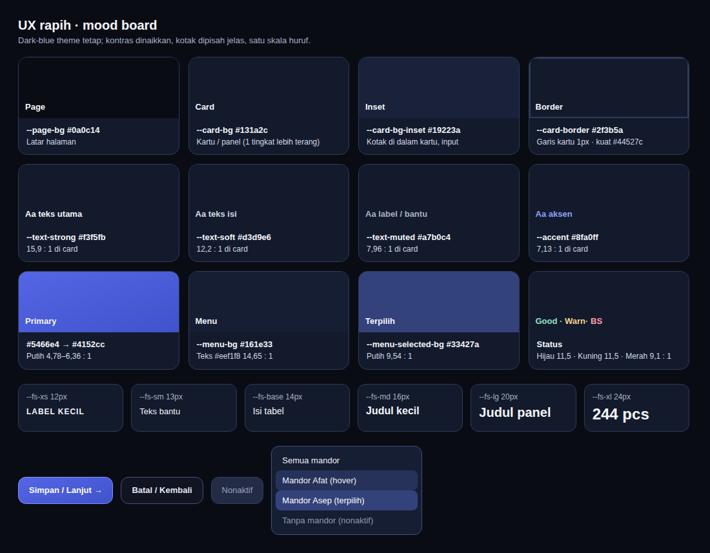

## 9. Sebelum / sesudah

| Halaman | Sebelum | Sesudah |
|---|---|---|
| Laundry (filter mandor: Mandor Afat) | 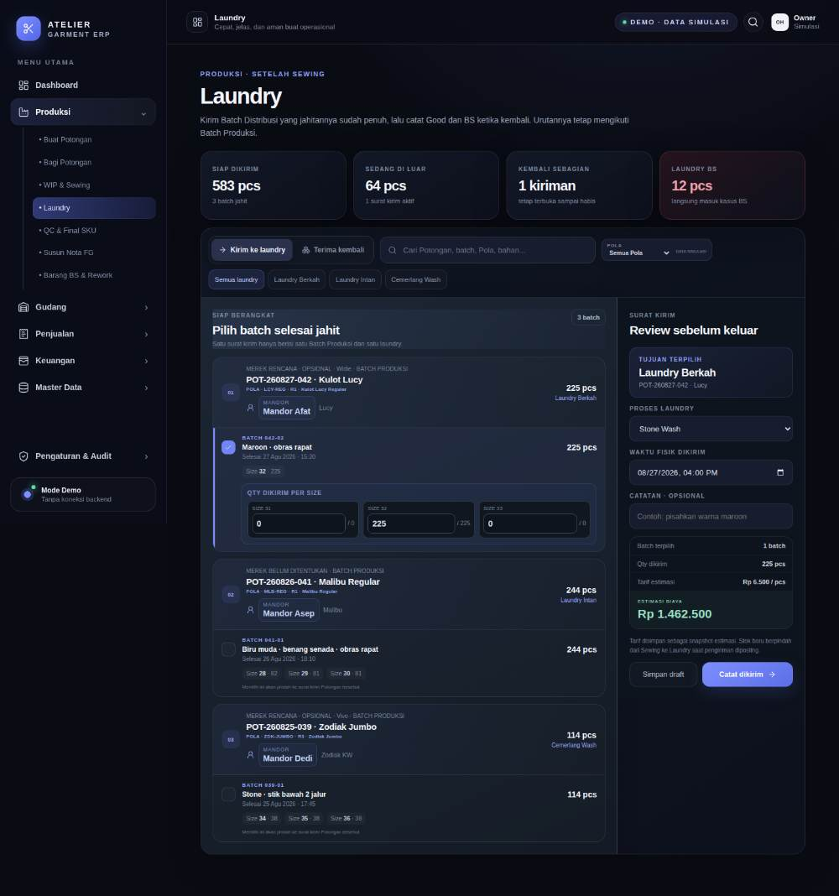 | 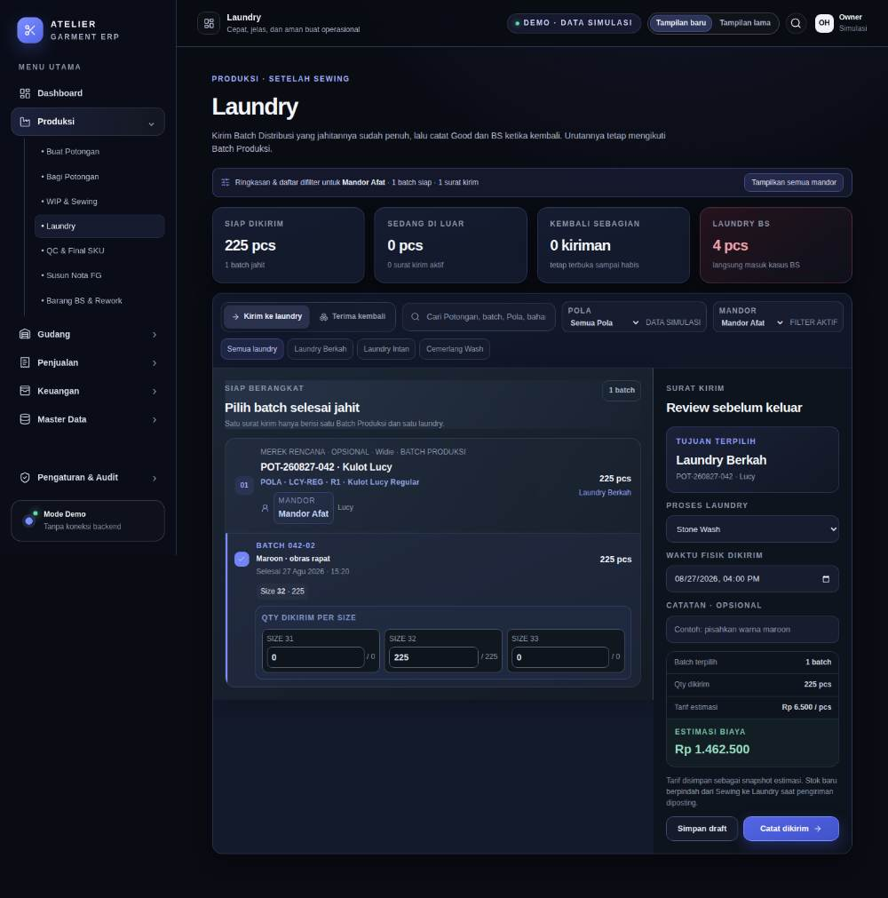 |
| Barang BS & Rework (SKU di tiap baris) | 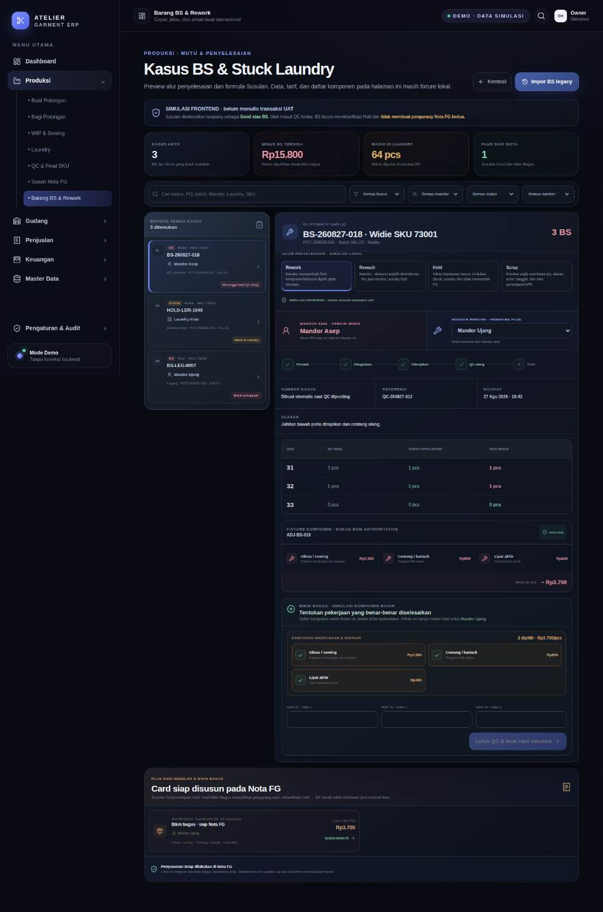 | 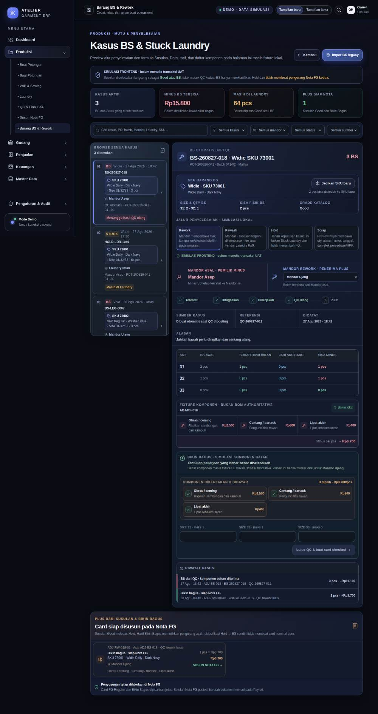 |
| WIP & Sewing | 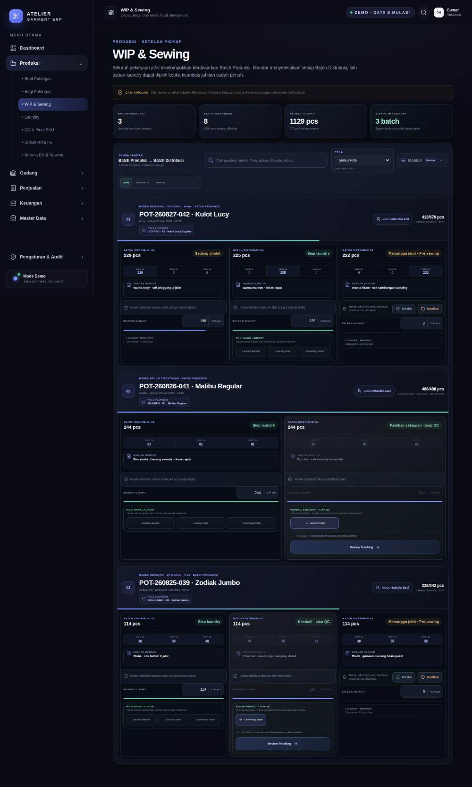 | 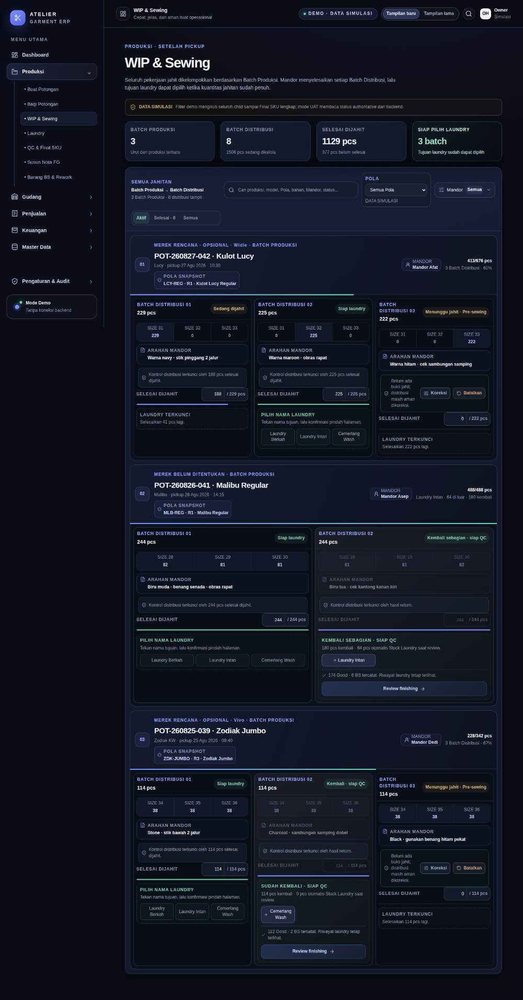 |
| Dropdown filter (custom) | 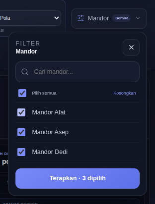 | 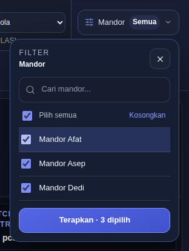 |
| `<option>` di popup putih ala Windows | 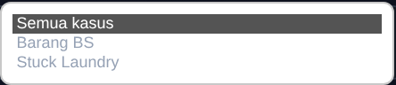 | 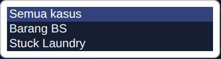 |

Form baru "Jadikan SKU baru": 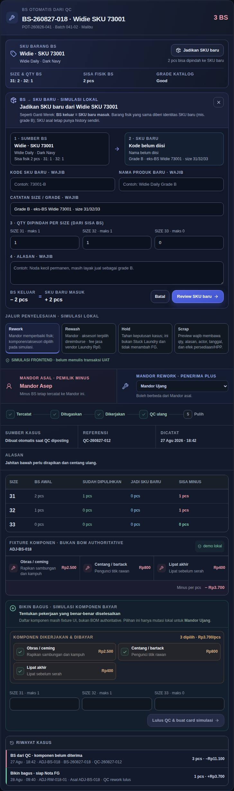

Gambar di atas dikompres (JPEG lebar 1000px). Set lengkap resolusi penuh
(desktop 1440px + HP 390px, termasuk Dashboard dan Pembelian & Penerimaan,
32 file) dibuat ulang lokal di `docs/ux/full/` — folder itu di-`.gitignore`
supaya repo tidak membengkak.

## 10. Revisi 7 Okt 2026 (masukan owner)

| Masalah yang dilaporkan / ditemukan | Perbaikan | Bukti |
|---|---|---|
| Spasi antar huruf terlalu lebar | Mirror `letter-spacing` dibatasi 0,02em (§1) | 46 halaman: **1.026 → 0** elemen teks bertracking > 0,03em (maks dulu 0,18em) |
| "Bahan & Roll": kartu *Bahan terpilih* menimpa drawer saat dibuka dari daftar browse | Drawer/modal dirender di akhir `<body>` (`components/OverlayPortal`): tidak lagi terjebak di kolom daftar yang `sticky`, dan tidak mewarisi gaya `header span` milik daftar | Crawler membuka setiap tombol di 46 halaman (desktop + HP): drawer tertutup di Bahan & Roll dan Ringkasan Gudang → 0 |
| Pilih barang di Stock Adjustment berupa satu dropdown datar "Merek · SKU · Size" | `components/BrowsePicker`: popdown dengan pencarian, dikelompokkan per merek/bahan, panah + Enter; size dipilih **sesudahnya** sebagai tombol berisi qty tercatat. Barang dan size tidak pernah dipilih otomatis. Area stok jadi tab. Ganti Merek memakai picker yang sama | Uji browser: cari "73002" → pilih → Size 32 → fisik 30 → delta −6 pcs; aturan lama (System Qty terkunci, adjustment positif lot produksi diblokir) tetap |
| Kolom daftar terlalu sempit, batas antar entri tidak jelas (WIP Potongan) | Kolom browse 300–380px (`--list-pane`, 24vw) di semua master-detail; setiap entri kartu berbingkai, jarak 8px, entri terpilih berbingkai aksen | WIP Potongan 226 → 328px di 1366px; Bahan & Roll, QC, BS, HPP, Master Data, Aksesori ikut |
| Cari pcs/batch di WIP & Sewing tidak muncul | Pencarian berbasis kata (`lib/search.ts`): setiap kata harus ada di isi yang tampil (label batch, pcs, size, status, arahan, laundry). Batch yang cocok saja yang ditampilkan, dengan keterangan "Menampilkan n dari m" + "Tampilkan semua". Diterapkan ke ±36 pencarian di 15 halaman | Audit "teks tampil tapi tak bisa dicari": sisa temuan hanya label/tombol (BAHAN, Edit, …) |
| Kotak pencarian dobel saat fokus | Cincin fokus pindah ke bingkai pembungkus untuk 52 input tanpa border (dibuat otomatis oleh generator) | Screenshot fokus WIP & Sewing / picker |
| Konten meluber keluar panel (ditemukan audit) | Grid ber-lebar tetap diganti kolom yang bisa menyusut/melipat: Penjualan & Invoice (ringkasan terpotong di 1366/1440), Aksesori, Stock Adjustment, Ganti Merek, HPP, QC, toolbar WIP/Potong, matriks harga Mandor, dan master-detail di HP | Audit 46 halaman × 6 lebar (1280/1366/1440/1536/1920/390): **14 kombinasi halaman-lebar rusak → 0**; "Tampilan lama" tidak berubah (309 = 309) |
| Batch distribusi perlu bisa dipecah lagi; opsi ubah/hapus tidak terlihat | WIP & Sewing: tombol **Pecah batch**, **Ubah arahan**, **Koreksi**, **Batalkan / Gabungkan kembali** selalu terlihat; yang terkunci diberi alasan | Lihat §11 |

| | Sebelum | Sesudah |
|---|---|---|
| Sumber & jejak angka (drawer) | 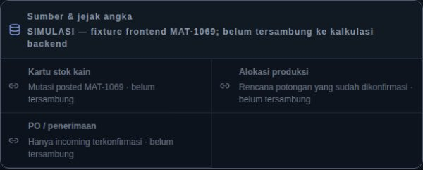 | 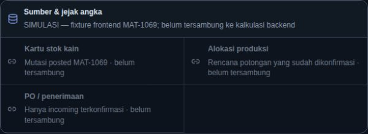 |
| Drawer dibuka dari daftar browse | 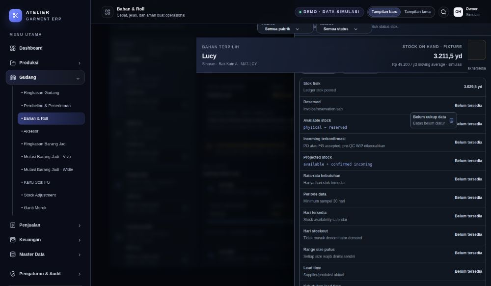 | 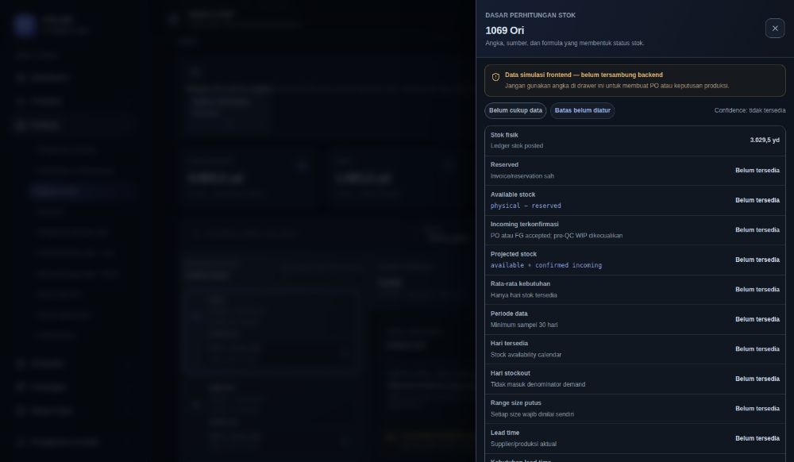 |
| Kolom WIP Potongan (1366px) | 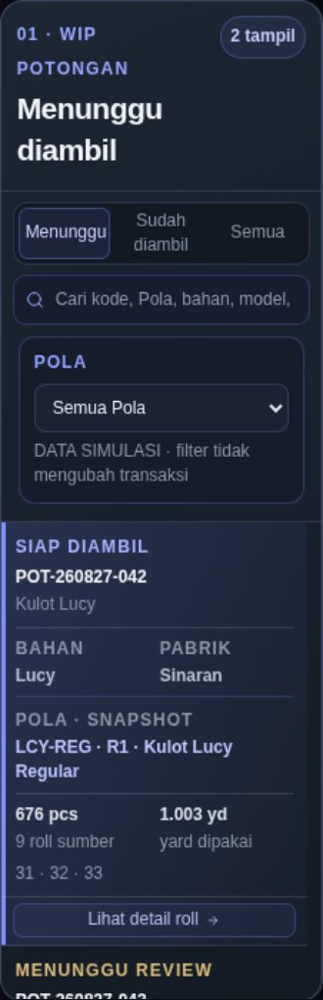 | 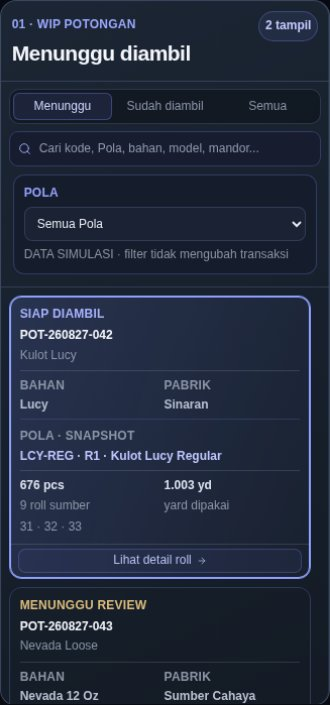 |
| Daftar Produk & SKU (1366px) | 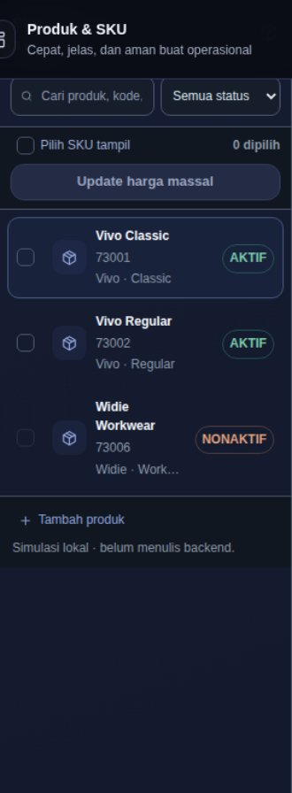 | 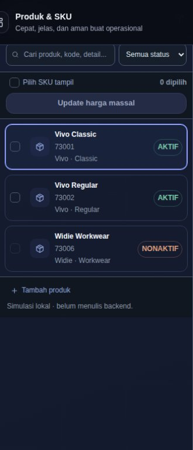 |
| Penjualan & Invoice (1366px) | 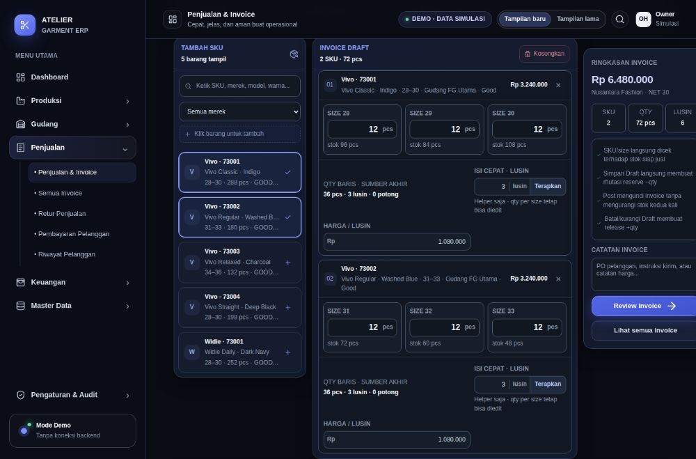 | 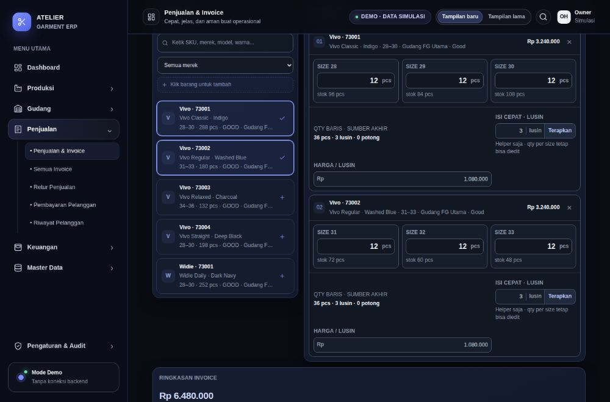 |

Stock Adjustment: 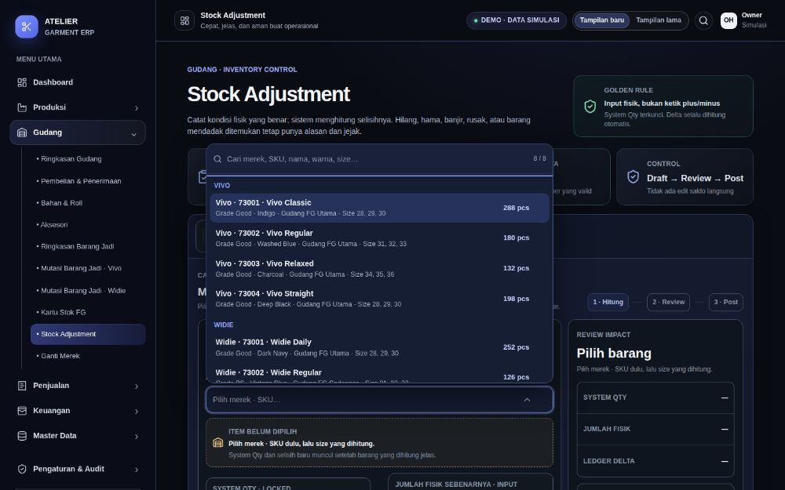 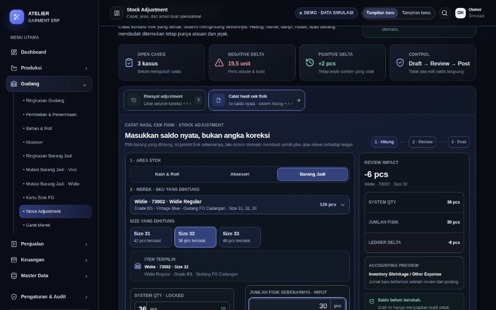

### Lanjutan: picker di halaman *Connected* dan menu lain

Catatan sebelumnya ("pemilih di halaman mode backend masih dropdown biasa,
picker perlu varian terang dulu") sudah dikerjakan:

- **`BrowsePicker` varian terang** — `tone="light"`: field putih, garis hangat
  `#d9cec7`, teks `#342c27`, aksen hijau `#315e48` seperti kartu halaman
  *Connected* (Buat Potongan, Bagi Potongan, WIP & Sewing). Warna ditulis
  sebagai custom property supaya mirror "Tampilan baru" (yang mencerahkan teks
  untuk tema gelap) tidak mengubahnya. Perilaku, ARIA (combobox/listbox),
  keyboard (panah, Home/End, Enter, Esc, Tab), portal ke `<body>` dan buka ke
  atas saat ruang sempit sama dengan varian gelap. Tambahan: `size="compact"`
  untuk toolbar/filter, `hideLabel` + `aria-label` bila caption sudah ada di
  halaman, baris `pinned` ("Semua Pola", "Belum dapat diidentifikasi") yang
  tetap terlihat saat mencari, dan pencarian server (`onQueryChange`,
  `filterOptions={false}`) untuk Master Pola. **Varian gelap tidak berubah**:
  computed style + ukuran picker Stock Adjustment & Ganti Merek dibandingkan
  sebelum/sesudah (baru/lama × 1366/390 × tertutup/terbuka) → 0 perbedaan.
- **Audit 86 `<select>`** di `src/`: 28 diganti picker, 58 tetap `<select>`
  (enumerasi tetap: status, jenis, mode, UOM, prioritas, termin, metode,
  grade, alasan, urutan; daftar konfigurasi pendek: gudang 2–3, akun kas/bank
  3, merek 2, role, kategori BOM, batch per roll 1..N).

| Halaman | Picker baru (searchable, dikelompokkan, info di baris) |
|---|---|
| Buat Potongan *Connected* | Production Order (per model; Mandor & tahap di baris) |
| Bagi Potongan *Connected* | Mandor; Filter Pola (cari di server) |
| WIP & Sewing *Connected* | Filter Pola (cari di server) |
| Barang BS & Rework *Connected* (tema gelap halaman itu) | Produk BS legacy; sumber claim Laundry (surat kirim / baris penerimaan, per Laundry, sisa pcs bisa diclaim); Mandor / Laundry penanggung jawab; Mandor rework / vendor rewash; claim settled (saldo pcs / Rp); Filter Pola CP5 |
| Bagi Potongan, WIP & Sewing, Laundry, QC (demo) | Filter Pola; Mandor (pickup, filter Laundry, filter QC); Laundry (QC); **SKU final** (QC, per merek, nama · warna · range) |
| Barang BS & Rework, Susun Nota FG, Absensi (demo) | Mandor (filter, rework, asal legacy, nota, absensi) |
| Penjualan & Invoice, Semua Invoice, Pembayaran, Riwayat, Piutang (demo) | Pelanggan / toko |

- **Aturan lama tetap**: nilai yang dikirim sama (dicek per RPC/payload di
  tes DOM); default lama tetap (PO pertama, Mandor aktif pertama, surat kirim
  pertama yang masih bisa diclaim, SKU pertama merek, merek rencana) dan tidak
  ada pilihan otomatis baru; kunci tetap beserta alasannya (Mandor dari PO,
  PO pada draft tersimpan — kini dengan teks alasan, Nota FG yang sudah
  posted, kasus BS tertutup); Mandor nonaktif pada draft tampil "TIDAK AKTIF"
  dan tidak bisa dipilih; ganti sumber claim / claim tetap mengosongkan qty;
  memilih ulang nilai yang sama tidak mereset form (sama seperti `<select>`).
- **Ditemukan saat cek visual dan diperbaiki**: (1) kartu "Identitas kanonik"
  Buat Potongan *Connected* terjepit ~120px (PO terbaca "PO-:") karena kotak
  Pola `grid-column: span 2` membuat kolom implisit; (2) WIP & Sewing
  *Connected*: angka KPI, judul kartu dan Pola snapshot putih di atas putih
  (kedua tampilan); (3) Tampilan baru: input/select di halaman *Connected*
  terang ("Waktu fisik diambil", "Urutan WIP") putih di atas putih karena
  `color-scheme: dark` → halaman itu kini `color-scheme: light`.
- **Bukti**: tes 196 → 235 (+39: 8 komponen picker, 16 picker *Connected*, 15 picker
  demo; tes lama yang memakai `<select>` diadaptasi tanpa melemahkan
  assertion); kontrak browser CP5 12/12, cutting-bridge + CP4.5 4/4;
  screenshot 31 pemilih × 1366/390 (tertutup + terbuka): popdown tidak
  terpotong, 0 scroll horizontal, 0 error konsol.

| | Sebelum | Sesudah |
|---|---|---|
| Bagi Potongan *Connected* (Tampilan baru) | 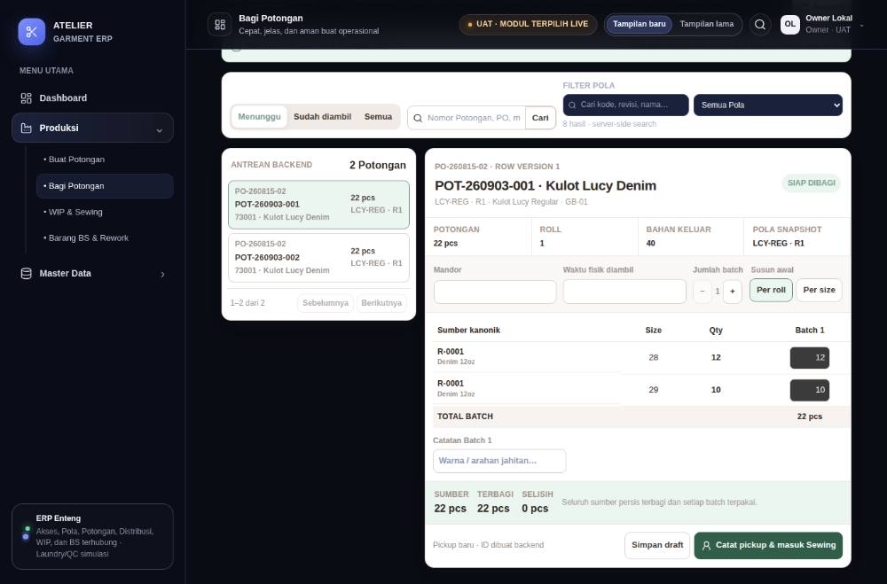 | 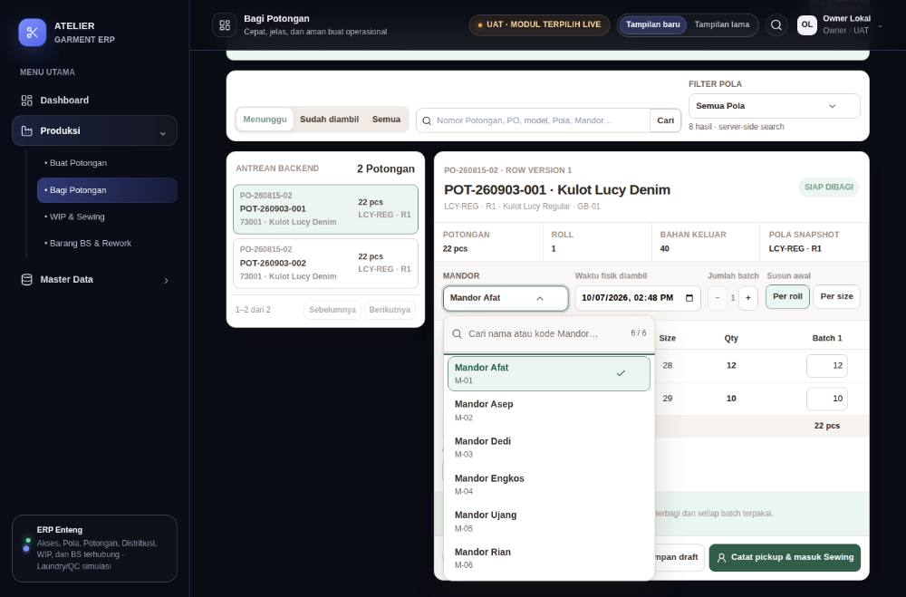 |

PO potong: 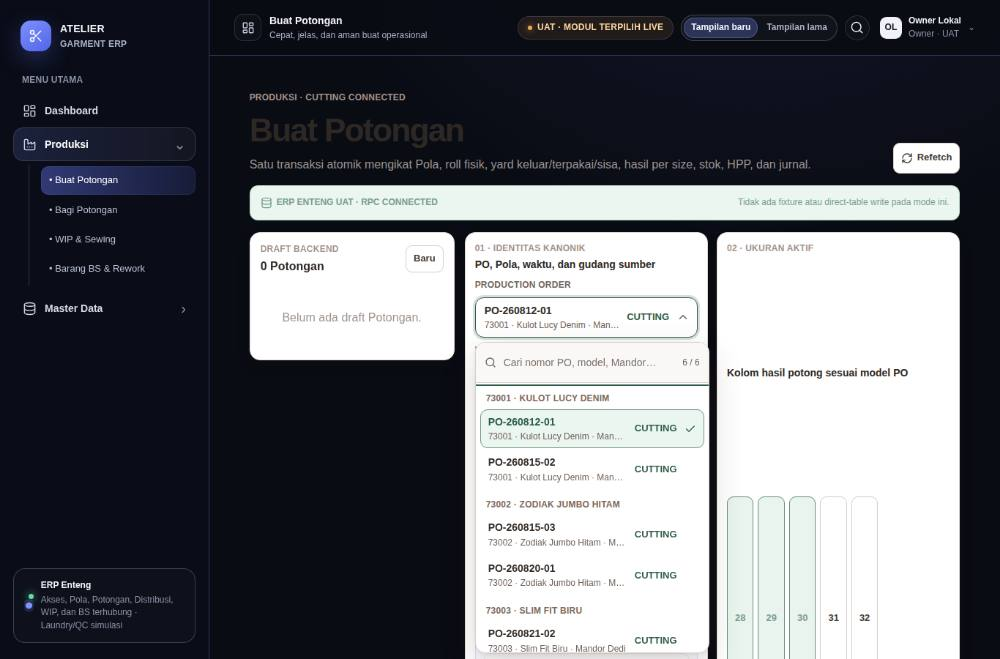 Claim Laundry: 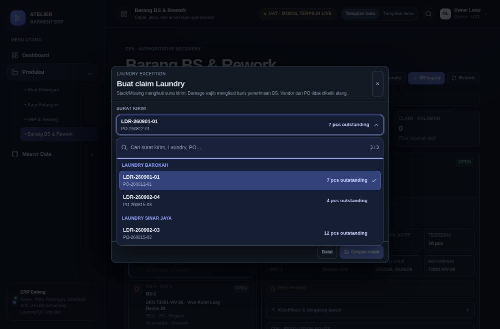 Filter Laundry: 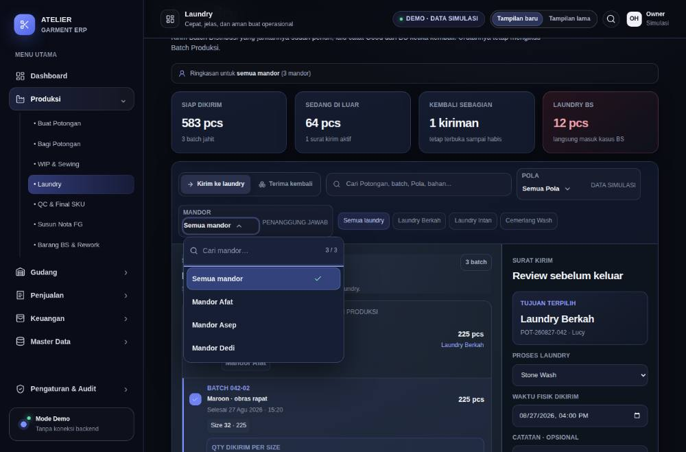

Belum diubah (dicatat jujur):

- **Produk BS legacy belum bisa "produk dulu, lalu size"**: lookup
  `erp_get_bs_resolution_workspace_v1` hanya mengirim `{id, sku, name}` per
  SKU-size (`erp.products.size_id` tidak ikut). Memisah size butuh perubahan
  RPC CP5 (di luar perubahan UI); sementara picker mencari SKU/nama.
- **`EnterpriseSelect`** (menu kustom, bukan `<select>`) untuk Mandor di Nota
  Ambil Aksesori dan Payroll belum diganti picker yang bisa dicari.
- **Tema halaman *Connected* di atas shell gelap**: judul hero Buat/Bagi
  Potongan coklat gelap di atas latar gelap, dan teks abu-coklat di kartu
  putih ikut dicerahkan mirror "Tampilan baru" (±3 : 1). Ini keputusan tema
  halaman, bukan picker.

## 11. Pecah batch distribusi (WIP & Sewing)

Kasus: sebagian pcs satu Batch Distribusi perlu jalur lain (mis. BS bahan
dicuci hitam, sisanya putih). Aturan (`src/wipSplit.ts`, diuji
`wipSplit.test.ts`):

- **Pcs tidak bertambah/hilang.** Per size: tinggal + baru = asal. Batch asal
  tidak boleh kosong (pindahkan sebagian saja).
- **Hasil jahit ikut terbagi.** Pcs sudah dijahit yang pindah dibatasi
  `max(0, sudah dijahit − sisa) … min(pindah, sudah dijahit)`, jadi tidak ada
  batch dengan hasil jahit melebihi isinya; total hasil jahit mandor tetap.
- **Penamaan:** batch asal jadi `02A`, pecahan `02B`, `02C`, … (huruf unik per
  batch asal, termasuk pecahan dari pecahan). Pecahan berarahan sendiri.
- **Dikunci** bila sudah ada pcs di laundry, hasil laundry kembali, draft surat
  kirim (hapus draft dulu), atau Final SKU lengkap — alasan ditampilkan.
- **Gabungkan kembali** mengembalikan pcs + hasil jahit ke batch asal selama
  keduanya belum punya dokumen laundry.
- Setiap pecah/gabung/ubah arahan tercatat di riwayat batch dengan catatan wajib.
- Pecahan dapat dikirim ke laundry (lookup laundry/QC mengenali pecahan; arahan
  ikut ke surat kirim).

Ini simulasi frontend (mode DEMO). Di backend Native, pecah batch belum ada:
butuh perintah baru dengan jejak stok, laundry dan payroll, serta keputusan
owner atas aturannya.

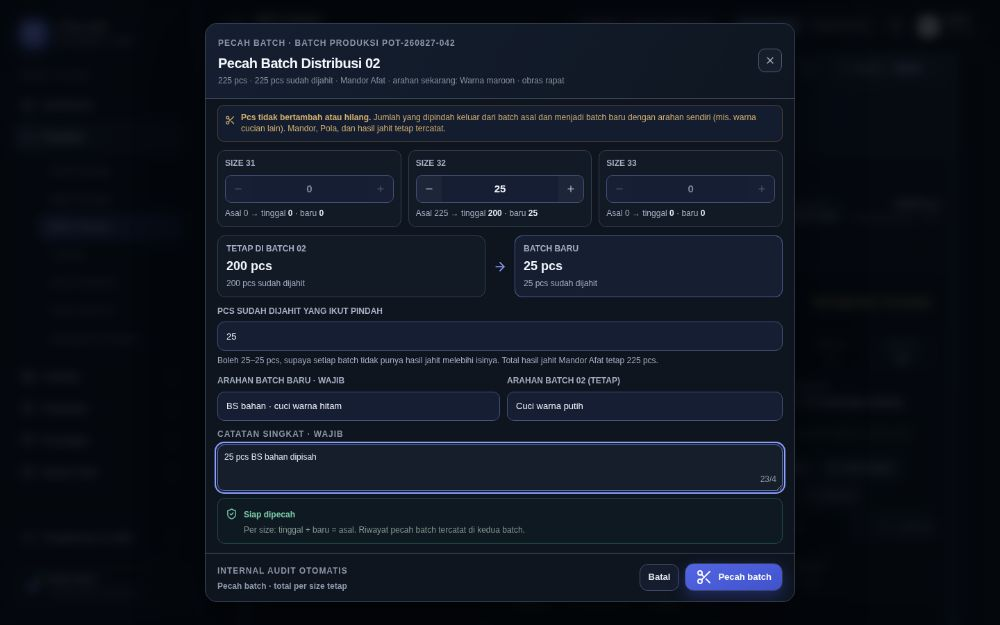
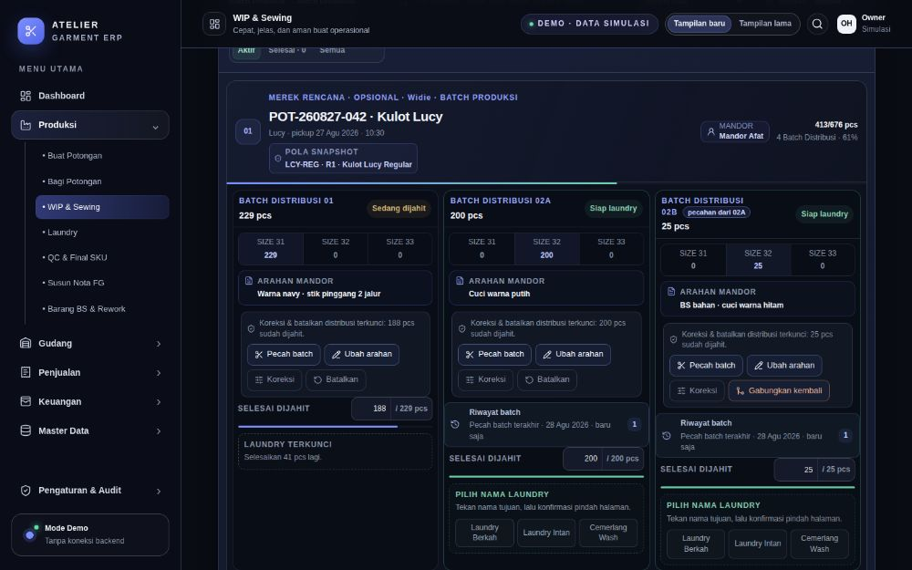

## 12. Merawat standar ini

- Tambah/ubah CSS seperti biasa di file komponen, lalu `npm run gen:ux-rapih`.
  `prebuild` menjalankan `check:ux-rapih` dan gagal kalau mirror basi.
- Aturan tangan (kartu, tombol, dropdown, perbaikan tabrakan) ada di bagian
  "3. Hand-written" `src/ux-rapih.css`; selalu diawali `.ux-rapih`.
- Teks baru: pakai token (`var(--fs-sm)`, `var(--text-muted)`), jangan px < 12.
- Modal/drawer/popdown baru: bungkus dengan `OverlayPortal`.
- Pilih barang dari katalog (SKU, roll, aksesori) atau entitas yang terus
  bertambah (PO, Pola, Mandor, Laundry, pelanggan, claim): pakai
  `BrowsePicker`, jangan satu `<select>` datar; size dipilih terpisah.
  `<select>` hanya untuk enumerasi tetap yang pendek. Halaman terang
  (*Connected*): `tone="light"`; toolbar/filter: `size="compact"`; caption
  sudah ada di halaman: `hideLabel` + `aria-label`. Handler yang mereset form
  dijaga agar memilih ulang nilai yang sama tidak mengubah apa pun.
- Pencarian daftar: `matchesSearch(query, searchValues(row), …label tampil)`.
- Kolom browse master-detail: `var(--list-pane)`.
