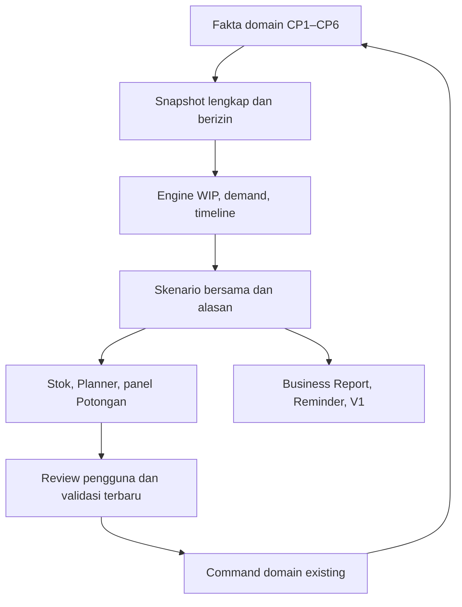

# Backbone teknis CP7

> **Revisi2 aktif:** baca `06_RUSUK_KEBUTUHAN_OWNER.md` terlebih dahulu. Kontrak AnalysisResult v2 menggantikan bentuk v1; pin/head dan receipt v1 di bab ini adalah sejarah persiapan, bukan accepted base. WA readiness dibawa ke CP7; aktivasi live tetap punya gate tersendiri.

Semua nama baru dalam dokumen ini adalah **PROPOSED CONTRACT v2**, belum endpoint/tabel yang tersedia. Nama existing diberi label existing. P01 mengunci nama final melalui katalog accepted CP6; perubahan memakai version/delta, bukan mengedit arti field diam-diam.

## 1. Keputusan arsitektur

**ADR-01 — satu engine authoritative pada backend Postgres existing.** Reader fakta, WIP/netting/matching, model evaluasi, scenario allocation, metrics dan reason codes menjadi fungsi modular pada schema analisis privat. React mengonsumsi hasil typed; tidak menghitung saldo atau menjalankan forecast sendiri. Ini pilihan rancangan teknis untuk mulai CP7, bukan kontrak bisnis owner.

Alasannya: aplikasi sekarang SPA statis di Cloudflare dengan Supabase; tidak ada application server/worker kalkulasi yang sudah terverifikasi. Memakai facade RPC existing menghindari penyebaran secret dan engine kedua. Source SQL dipecah per domain/kernel dan dirakit deterministik; **bukan menambah satu migration besar setiap eksperimen**. Python prototipe lama berguna untuk pembanding matematika, bukan implementasi produksi kedua.

P02/P07 mempunyai gate performa: ukur native pada profil kecil/sedang/besar. Bila model berat tidak memenuhi batas kerja, keluarkan satu computation layer utuh ke runtime server yang di-review dalam ADR baru; transport dan schema hasil tetap. Jangan menjalankan versi SQL dan JS dengan rumus berbeda. Ini jalur keputusan jika ada bukti bottleneck, bukan pekerjaan infrastruktur yang otomatis dibuka sekarang.

**ADR-02 — snapshot fakta immutable sebelum komputasi bertahap.** Jangan menyatukan enam RPC live pada enam waktu berbeda. Capture fakta minimum seluruh scope dengan satu operasi snapshot konsisten, kemudian semua model/pages membaca fakta yang telah dibekukan itu. Data live baru menghasilkan stale, bukan mengubah hasil di tengah operator bekerja.

**ADR-03 — projection tidak menulis bisnis.** Role eksekusi analisis memiliki SELECT ke input yang diperlukan dan write hanya ke schema analisis/perhatian yang disepakati. Tidak punya hak menulis ledger/domain atau EXECUTE mutator bisnis. Facade narrow harus menolak actor null/inactive/unauthorized sebelum cache/replay. Jangan memakai service-role browser atau memberi blanket SECURITY DEFINER sebagai obat permission error.

**ADR-04 — source identity dan dependency register bersama.** Setiap source fact mengikat ID asal, line, size, effective identity, source revision dan waktu. Satu registry resolved memetakan input→fungsi→consumer→test, sehingga dampak satu perubahan dapat diketahui tanpa membaca semua file.

Diagram membedakan arus baca dari apply. Membuka consumer tidak mengikuti panah apply secara otomatis.

## 2. Model data minimum

| Entitas rancangan | Kunci / isi | Aturan |
|---|---|---|
| `analysis_run` | run_id, request_id/hash, actor/access epoch, scope, cutoff, capture/hash/version, status | Same request+payload replay; request sama payload beda reject. Refresh disengaja request baru |
| `analysis_fact` | run_id + fact_kind + canonical_source_key; JSON typed/kolom terindeks per jenis | Immutable; unique key mencegah fact yang sama masuk dua kali; jumlah belum lengkap tidak publish |
| `analysis_dependency` | run_id, domain, version/hash, contract version, completeness | Daftar sumber penentu stale; jangan menebak hanya `max(updated_at)` |
| `production_policy_version` | brand/product-identity-version, state ACTIVE/PAUSED/STOPPED, reason, review_at, actor | Terpisah dari master `is_active` dan izin jual; histori append-only |
| `planning_policy_version` | scope inheritance, demand/buffer/model/ranking/calendar parameters | Satu effective version; priority explicit; fixture values tidak menjadi production default |
| `analysis_scenario` / `scenario_allocation` | scenario_id/version, run_id, source+size, target, qty, ETA assumptions | Alokasi simulasi, tidak reservation; constraint kapasitas di dalam satu skenario |
| `analysis_action` | stable action key, intent, source group, demand children, reason IDs | Grouping tidak membuat sumber baru; satu intent/source punya satu kartu utama |
| `planning_draft` / `plan_action_intent` | draft version, input refs, overrides/reason, request/outcome | Read tidak membuat draft. Intent menghubungkan apply dan outcome; bukan ledger stok baru |
| `business_report` / `report_revision` | immutable published body/data, run/scenario/policy/template, period, prior_report_id | Original utuh; current pointer tunggal; revisi baru eksplisit |
| `condition_observation` / existing reminder link | condition key, source key, policy, episode, observed quality, attention | Manual lifecycle existing tetap. Source-resolved berbeda dari ACK/snooze/DONE |

Implementasi boleh menggabungkan tabel analisis yang benar-benar setara; makna kontrak tidak boleh hilang. Cek kemampuan existing sebelum membuat tabel baru. `plan_action_intent` menyimpan hasil apply, **tidak** mengurangi availability saat draf dibuat.

### Bentuk nilai

- Quantity COUNT: integer nonnegative dalam unit dasar; nilai projection balance boleh signed dan harus bertanda SIMULATION.
- Quantity decimal dan uang: decimal string dengan precision/scale sesuai kontrak domain; uang exact NUMERIC, tidak float JavaScript. Rate dan nominal punya scale berbeda. Round hanya di boundary sah; residual sen ditugaskan deterministik dengan source trace.
- `Value<T> = KNOWN(value, source_refs) | ASSUMED(value, assumptions, source_refs) | UNKNOWN(reason) | CONFLICT(reason, refs) | NOT_APPLICABLE(reason)`. API malformed/partial adalah error/kualitas, bukan varian KNOWN(0).
- Currency, UOM, ownership dan size adalah field eksplisit; compiler/schema tidak menganggap semua `number` boleh dijumlah.
- Status kualitas per domain: quantity, demand, identity, timing, material, capacity, financial. Tidak ada satu `confidence=90%` yang mencampur semuanya.

### Identitas target

`PRODUCT`: brand_id + physical product_id + product_version_id + exact_size_id, dilengkapi commercial_identity/membership bertanggal sesuai bab06. Commercial SKU tidak menggantikan physical root/size. `CANDIDATE`: model/pattern_revision + material constraints + exact_size + process/finish constraints + allowed brand, tanpa product_id palsu. Kandidat tidak memiliki histori jual sendiri sebelum relasi pembanding sah dipilih dan dilabeli.

### Identitas source

Gunakan stable lineage key dari sumber existing: cutting group/yield line → batch child+size → completion/allocation → delivery/receipt line → QC lot → FG lot, dengan reference reversal/return/conversion. `source_key` bukan sekadar nomor PO atau label SKU. Dua dokumen menunjuk sumber fisik sama harus dinormalisasi ke remaining slice yang sama. Tidak perlu serial per PCS.

## 3. Capture snapshot dan waktu

1. Validasi actor dan scope berdasarkan akses terkini. Scope analisis/alokasi berbeda dari filter tampilan.
2. Tetapkan `effective_as_of`, `known_as_of`, timezone bisnis Asia/Jakarta, `period_start/end`, dan semantic versions. `known_as_of` lebih lama hanya diterima jika histori/audit memang dapat merekonstruksi fakta saat itu.
3. Capture semua fakta yang saling bergantung dalam **satu snapshot MVCC**. Rancangan awal: satu statement `INSERT … SELECT` dengan reader STABLE yang mengambil semua domain terkait; bukan loop volatile yang membaca live setelah tiap commit. Writer harus membuktikan snapshot concurrency, bukan mengandalkan nama STABLE.
4. Persist fakta analisis dan manifest atomik: row counts, boundary/cursor completion, canonical source keys, dependency vector, semantic hash. Capture gagal berarti tidak ada run COMPLETE.
5. Komputasi bertahap membaca facts immutable. Pagination UI memakai run_id+cursor stable. Query live yang belum selesai diberi CAPTURING/PARTIAL dan tidak masuk netting sebagai nol.
6. Saat publish/serve: cek izin saat ini; tanda stale jika dependencies berubah. Arsip as-of boleh tetap dibaca bila izin masih sah dan label historis jelas. “Terbaru” hanya untuk run yang memenuhi kontrak current.
7. Saat apply: selalu revalidate sumber live di transaksi mutasi. TTL cache bukan bukti sumber belum berubah.

`source_revision` harus berasal dari row version/event sequence yang dapat membedakan insert/backdate/reversal/recost/policy/status/calendar changes. Delete tidak hilang dari vector. Waktu dinding, jumlah baris, atau max timestamp saja tidak cukup.

Untuk sumber sebelum pencatatan knowledge history tersedia: `AS_KNOWN_UNAVAILABLE`. Jangan merekonstruksi masa lalu memakai koreksi masa kini lalu melabelinya “diketahui saat itu”. Current restatement boleh memakai effective cutoff dengan label RESTATED.

### Snapshot lintas role

Alokasi global mempertahankan keterbatasan sumber walau pengguna memfilter merek. Engine server dapat memeriksa constraint sumber di boundary privat; response hanya memuat fakta dan derived values yang diizinkan. Jika menampilkan remaining capacity akan membocorkan angka scope lain, tampilkan status umum `SCOPE_RESTRICTED`/perlu review berwenang dan tahan aksi yang tidak dapat dibuktikan. Jangan mengembalikan angka tersembunyi lewat total, jumlah kandidat, ranking, cache hit, prompt atau error. Filter bukan reset kapasitas.

## 4. Pipeline algoritme yang menjadi satu otak

### A. Normalisasi dan quality gates

Validate shape/UOM/identity/version → deduplicate by source lineage → resolve latest state at cutoff → classify ownership/condition → reconcile input/output/reversal → mark per-domain availability. Hindari `Number(x)||0`, koleksi missing→`[]`, fuzzy ID, dan menebak record inactive tidak penting.

Jika quantity critical UNKNOWN/CONFLICT, hasil keputusan aktual `DATA_BELUM_CUKUP`; simulasi berasumsi boleh terpisah. Bila hanya biaya unknown, quantity/timeline tetap boleh dihitung dengan financial status terbatas.

### B. WIP unique remaining

Untuk tiap lineage slice+size: opening/input sah + linked returns/reversal yang relevan − downstream transfer/terminal output yang berlaku. Posisi aktif dibuktikan dari state transition/cumulative quantities, bukan `sum(all stage counters)`.

Pisahkan: cut-unassigned, sewing-active, laundry-outstanding, laundry-returned-await-QC, FG actual, terminal BS, missing/stuck/hold, rework/rewash. Dispatch/receipt adalah event transisi; incoming yang memakai source sama dikeluarkan dari penjumlahan tambahan. Rework GOOD mengembalikan/mentransformasikan sumber yang sama, tidak mencetak produksi/denominator baru.

Projection GOOD tidak melebihi sisa input setelah constraint/yield. Jika yield asumsi 90%, tunjukkan input, projected output, dan expected loss terpisah. Qty loss projection belum menjadi BS aktual. Setiap shortage tetap exact size.

### C. Matching calon hasil

1. Hard incompatibility → TIDAK_COCOK: size/range, incompatible pattern revision, material origin, actual wash/process, color/finish, brand/label yang telah mengikat.
2. Confirmed destination + lineage compatible → SESUAI_TUJUAN.
3. Known constraints compatible, tujuan belum confirmed → KANDIDAT_COCOK.
4. Critical matching metadata missing/weak historical hint → PERLU_CEK.
5. Source read incomplete/conflicting → BELUM_DAPAT_DIPASTIKAN.

Nama mirip, pola sama, atau SKU pada paket tarif laundry tidak cukup. Histori boleh memberi contoh dan sample count, bukan calibrated probability. Metadata SKU opsional kosong tidak otomatis reject semua WIP.

### D. Demand ledger dan observasi

Kunci lifecycle penjualan menghubungkan draft/post/cancel/return. Pisahkan penjualan teramati, permintaan tersensor saat stockout, hari tersedia tanpa penjualan, unknown availability, one-off/event yang memang tercatat, dan manual target/analog berlabel.

Urutan sumber: histori sendiri sah → analog/kelompok beralasan → target manual/skenario uji yang dipilih. Tidak ada auto12 PCS ke semua SKU baru. Retur bukan penghapusan otomatis minat pembeli. Forecast masa depan memakai demand residual setelah transaksi yang sudah masuk cutoff; order baru tidak dibangun dalam CP7.

Kontrol availability: FG100, draft24, residual demand20 → proyeksi56. Draft→posted tetap56. Salah bila memotong draft24 lagi atau memperlakukan posted sebagai demand kedua.

### E. Forecast, target dan evaluasi adaptive

Kernels rancangan: mean/naive/moving mean, SES, damped Holt, seasonal naive, SBA, TSB. Holt–Winters/ETS tambahan hanya bila evidence/data dan kebutuhan mendukung; tidak ada klaim semua metode riset sudah wajib terpasang. Registry metode berisi eligibility, training requirement relatif H, season length, fit parameters, predictions, metrics, failure mode dan version.

Fallback: `H=L+R`; `Target=ceil(D*(L+R+B))` pada mode buffer hari. Parameter 28 hari history, L21/R7/B7 dari kontrak hanyalah **usulan awal berlabel**, bukan angka pabrik terukur. Pada mode statistik, target adalah kuantil kebutuhan agregat horizon H sesuai policy layanan yang dipilih, tanpa menambah buffer hari otomatis. Quantile harian tidak boleh dijumlah seolah quantile horizon.

Rolling-origin: seluruh training dan tuning sebelum validation cutoff; outer holdout tidak disentuh untuk memilih parameter. Backdated entry baru tidak muncul pada fold lama. Tentukan metric pada jumlah/periode yang sama: MAE, signed horizon bias, absolute horizon-total error; MASE/RMSSE N/A bila denominator nol; MAPE tidak menjadi default saat aktual nol.

Proposal teknis awal untuk promosi model: minimal tiga fold evaluasi yang benar-benar memiliki horizon lengkap, primary metric lebih baik dan guard bias/tail error tidak lebih buruk, tie memilih model lebih sederhana. Ini default rancangan yang harus dikualifikasi P07; bukan kebijakan layanan owner. Bila bukti tidak cukup, pertahankan baseline. Tidak menggunakan skor sintetis sebagai janji hemat modal/akurasi pabrik. Setiap pemilihan menyimpan contender scores, folds, alasan ditolak, model/policy versions.

Data 28 hari tidak otomatis cukup untuk train28 + validate28 + holdout28. Zero yang sah memperbarui TSB; stockout/unknown tidak diperlakukan sebagai zero observation. Target layanan, akurasi historis, confidence statistik dan kelayakan WIP selalu terpisah.

### F. Timeline, netting dan skenario

`Q_base=max(0,Target−FG_available−directed_WIP_on_time−unique_incoming_on_time)`.

`Q_conditional=max(0,Q_base−candidate_allocated_eligible_on_time)`.

Keduanya ringkasan horizon, harus disertai `balance_end(t)=balance_start(t)+unique_supply(t)−residual_demand(t)`. Tetapkan urutan intrahari jika ada timestamp; jika hanya tanggal, gunakan asumsi timing eksplisit dan jangan mengklaim kebutuhan pagi terpenuhi barang sore. Supply hari20 tidak menghapus gap hari10. Negative simulated balance memakai mode BACKLOG yang dilabeli; LOST_SALES memakai unmet demand terpisah dan tidak mencarry minus sebagai backlog tanpa kontrak.

Safety target tidak dianggap konsumsi harian dan tidak dikurangi dua kali. Produksi baru hanya menutup kebutuhan setelah lead time aktual/asumsi. Early gap yang tidak dapat dipenuhi diberi tindakan expedite/cek sumber, bukan selesai palsu.

### G. Allocation, material, capacity dan prioritas

Untuk setiap `source+size`: jumlah alokasi seluruh target pada **skenario yang sama** ≤ kapasitas physical eligible; setelah yield, input/output tetap dilacak. Dua skenario alternatif tidak dijumlah. Alokasi sama tetap berlaku lintas halaman/filter. Draf berbeda tidak mereservasi sumber tetapi konflik antar-draf ditampilkan; saat apply latest state menentukan pemenang.

Allocation awal memakai urutan prioritas yang dijelaskan, deterministic tie-break, dan fill sesuai constraint; bukan klaim optimasi global. Ranking: risiko gap sebelum supply siap → deadline nyata → aksi yang lebih cepat membantu → size gap → stable ID. Unknown timing masuk daftar data perlu dicek, tidak otomatis urutan terakhir/aman. Margin hanya boleh ikut bila policy memilih dan cost valid.

Material kebutuhan tersisa = kebutuhan sah − konsumsi/pemasangan terbukti; tambahan eksternal = kebutuhan tersisa − sisa eligible yang terbukti tersedia dan dialokasikan ke pekerjaan itu − incoming unik tepat waktu. Issue bukan consumption. Kebutuhan100, pemasangan60, sisa20 terverifikasi → belum terpasang40, tambahan20. Issue80 saja → tambahan unknown. Stok customer/karantina/rusak tidak dimasukkan ready secara otomatis.

Kapasitas tahap memakai calendar+available capacity−existing load; tanpa waktu per unit/capacity valid tampilkan skenario/UNKNOWN, jangan menciptakan throughput pabrik. Gap100 dengan kemampuan60 tetap gap100, feasible60, unresolved40. Tidak menamai shortage60. Calendar/material change menandai run stale.

### H. Grouping dan presentation contract

Action key mengikat intent+canonical source/group+scenario. WIP satu batch membantu A/B → satu kartu dan child demand. Dua batch pola sama boleh heading bersama, kapasitas tetap terpisah. Fisik telat dan invoice pending pada batch sama adalah dua intent tertaut, tidak saling resolve.

Usulan cutting dikelompokkan oleh compatible pattern revision/material/rute/need window, dengan exact brand/SKU/size children. Grouping visual tidak menggabungkan PO, roll, invoice atau histori otomatis. Qty net, rounded qty dan rounding extra selalu tampil.

Output action mengandung primary reason, supporting reasons, uncertainty, source links, next authorized command, display priority. Tidak ada score engine di JSX. Same run/scope/scenario/version → same business numbers and reasons di semua consumer. AnalysisResult v2 membawa allocation_edges per source→target serta timeline typed dan context metric; rincian bab06 §4 berlaku.

## 5. RPC dan state machine

| Kontrak rancangan | Input penting | Output / status | Write yang diizinkan |
|---|---|---|---|
| `erp_cp7_start_analysis_v1` | request_id, scope, cutoffs, policy ref, scenario mode | run_id, capture receipt, status | Analysis facts/header saja |
| `erp_cp7_continue_analysis_v1` | run_id, request_id, expected work cursor/version | chunk progress, next cursor, complete/failed | Derived analysis; bounded work, owner claim, no ledger |
| `erp_cp7_get_analysis_v1` | run_id, scenario, filter/cursor, expected versions | authorized typed result + completeness/stale | None |
| `erp_cp7_save_scenario_v1` | run/scenario version, source allocations, overrides+reasons | feasible/conflicts, new scenario version | Scenario saja |
| `erp_cp7_set_production_status_v1` | identity IDs, expected versions, ACTIVE/PAUSED/STOPPED, reason/review date, request_id | updated histories or atomic refusal | Production policy saja, explicit user action |
| `erp_cp7_save_plan_draft_v1` | run/scenario, chosen actions, expected draft version, request_id | draft + dependencies + stale state | Planning draft saja |
| `erp_cp7_preview_plan_action_v1` | draft/action IDs | live preflight, exact domain mapping | None; jika lock diperlukan deklarasikan volatility dengan benar |
| `erp_cp7_apply_plan_action_v1` | draft/action version, request_id/hash, explicit review | existing domain command result and linked intent | Satu command domain yang sah dalam transaksi atomik |
| `erp_cp7_publish_report_v1` | complete run/scenario, period, template, request_id, prior revision | immutable report, revision/current pointer | Analysis/report saja |
| `erp_cp7_observe_conditions_v1` | complete run/domain subset, policy | conditions + linked existing reminder episodes | Observation/attention saja |

Schema types, runtime parser dan RPC allowlist berasal dari kontrak yang sama. Nama yang tidak ada belum boleh dipanggil UI. Public facade mengikuti model Auth existing. Internal helpers default revoke EXECUTE dari PUBLIC/anon/authenticated; exposed objects punya grants+RLS yang sesuai. Views yang digunakan harus mempertahankan RLS melalui security_invoker atau ditutup dari API. Definer yang benar-benar perlu diberi actor guard, fixed search_path, object allowlist, role privileges minimum, dan negative API tests.

Run: REQUESTED → CAPTURING → CAPTURED → COMPUTING → COMPLETE; error → FAILED/PARTIAL, tidak pernah COMPLETE hanya karena command exit0. Snapshot frozen tidak membutuhkan lock WIP/stock selama compute. Continue mengklaim work chunk secara atomik; lease+fencing bila pekerjaan lintas request; retry tidak menggandakan results. Tidak ada scheduler otomatis pada CP7. Run tersisa setelah tab ditutup berstatus belum selesai dan dapat dilanjutkan secara eksplisit; otomatis hidup mandiri adalah CP7C.

Draft: DRAFT → REVIEW_REQUIRED/STALE → VALIDATED_FOR_PREVIEW → APPLYING → APPLIED; ambiguous transport → VERIFYING. Preview tidak menjamin state masih valid saat apply. Data berubah mengembalikan review requirement. PARTIALLY_APPLIED hanya di tingkat kumpulan beberapa command yang sengaja berbeda; setiap command domain sendiri atomik. UI menampilkan item sukses/pending dengan request IDs; jangan berpura-pura keseluruhan batch atomik jika backend tidak menjamin.

## 6. Apply tanpa double production

1. Jalankan global recovery fence existing; outcome ambigu pada source yang berpotensi sama harus diselesaikan dulu.
2. Server autentikasi dan authorize terbaru sebelum replay. Compare request payload hash; lookup outcome untuk request yang sama.
3. Lock dalam urutan canonical domain existing. Tambahan scope `target identity+size / plan intent` hanya bila diperlukan untuk menahan dua rencana membuat produksi yang sama; jangan mengambil lock pocket/finance untuk read yang tak terkait.
4. Re-read production status, source remaining, shared capacity, confirmed production dan dependency revisions. Bandingkan dengan draft; stale → refusal dengan alasan dan tanpa effects.
5. Untuk sumber existing: domain consumption mencegah double penggunaan fisik. Untuk **dua draft dari run berbeda yang sama-sama mengusulkan potong baru**, gunakan target/dependency conflict check dan linked action-intent uniqueness, bukan hanya request_id. Re-evaluate coverage setelah pemenang menciptakan confirmed production; loser review ulang.
6. Invoke existing command; record APPLIED intent dan refs di transaksi yang sama. Tidak dua langkah commit terpisah yang meninggalkan command tanpa receipt.
7. Balasan sukses lalu refetch gagal: tampilkan “Tersimpan, data perlu diperbarui”; jangan membuka submit ulang. Same request replay mengembalikan command yang sama. Override tambahan oleh owner harus eksplisit setelah melihat rencana baru; bukan bypass hidden.

P08 tidak boleh mengaku ini ada sebelum native two-connection proof. Kalau existing command tidak menyediakan precondition yang diperlukan, bridge additive termasuk paket itu; jangan mengirim qty dari URL atau memanggil private mutator browser.

## 7. Business Report dan metric dictionary

Setiap metric: id/version, unit, scope, effective period, knowledge mode, operands+source refs, formula, numerator/denominator bila ratio, quality, financial-readiness, rounding, comparability. Narasi template menerima structured finding, bukan string SQL/HTML bebas.

| Metric | Definisi operasional | Guard |
|---|---|---|
| Actual FG | Saldo authoritative eligible per brand/size/location setelah draft effect | Tidak ditambah WIP; actual-low bisa bersamaan projected-covered |
| Directed/candidate supply | Unique source qty dan ETA; candidate allocated hanya dalam scenario | Candidate total per SKU tidak dijumlah lintas alternatif |
| Stock cover | Eligible FG / valid demand rate dengan horizon/source jelas | Demand nol/unknown → N/A yang tepat; tidak infinity dijadikan aman |
| Sales/revenue | Facts penjualan sesuai accounting contract; draft sales signal terpisah | Tidak menyamakan penerimaan kas dengan omzet |
| Cash actual | Ledger kas/bank bertanggal; internal transfer netral pada total scope | Unpaid invoice bukan kas; reversal/refund ikut sumber |
| AR/AP outstanding | Nominal eligible − linked settled/credit sesuai lifecycle | Bukan seluruh invoice + seluruh payment diperlakukan arus baru |
| HPP/margin | Valid source cost/COGS pada periode; pending recost eksplisit | Tidak memakai unknown=0 untuk profit/ranking |
| Growth/margin change | (current−baseline)/baseline; margin delta dalam poin persentase | Baseline0 → N/A; margin27%→24% = −3pp; aggregate dari operands |
| Aging | Cohort penerimaan/ownership sah dan cutoff | Last movement bukan umur semua stok |
| Plan vs actual | Frozen plan+version dibanding realized sales/GOOD/lead time menurut rule | Tidak menilai rencana masa lalu dengan fakta yang belum diketahui saat itu |

Finding selalu menjawab: apa/siapa, scope/periode, angka dan sumber, syarat/unknown, tindakan berikut, status attention/source. Contoh: “Pada skenario S1 masih ada kebutuhan8 PCS. Angka ini mengasumsikan10 PCS dari batch B1 cocok dan siap pada hari6. Periksa batch/ETA sebelum membuat tambahan.” Jangan menghapus “jika” saat membuat paragraf.

Semantics hash mencakup fakta normalisasi, policy, model, scenario, template dan permission projection. UUID/run ID/generated_at tidak mengubah business semantic hash; **chronology bisnis tidak boleh diurut ulang secara sewenang-wenang**. Simpan hash bytes artifact terpisah. Run opaque di URL tidak berisi payload personal/qty/secret.

Report lama tidak ditimpa; recost baru menandai current stale dan boleh menerbitkan revisi tertaut melalui tindakan sah. Tidak otomatis rebuild/send semua history. Daily/weekly/custom periods membandingkan periode sebanding; intraday bukan dibandingkan hari penuh tanpa label.

## 8. Reminder dan Tanya AI

Reuse manual reminder existing (list/save/done/cancel) dengan server persistence. Evaluator in-app memakai run dan metric yang sama. Condition key = rule version+entity/source+scope+kind; episode berulang tertaut. Observasi unknown tidak menutup incident. ACK/snooze/DONE manual adalah perhatian, bukan bukti shortage/invoice selesai. Hysteresis/comparator/cooldown mengikuti policy yang eksplisit; nilai null, 0, disabled dan invalid berbeda.

CP7 menyiapkan seam scheduler/outbox dan metadata schedule bila existing, tetapi tidak mengaktifkan delivery. RMD-T18–T31 yang menyangkut waktu/transport/destination masuk CP7C; security/no-egress guard tetap diuji di CP7. Read/send/prompt tidak menulis domain ledger.

Tanya AI V1 menggunakan satu serialized authorized AnalysisResult. Clipboard success baru diklaim setelah API clipboard berhasil; popup gagal menyediakan tombol terpisah. Prompt berupa selectable text; tidak query-string, tidak auto-send/login, tidak meminta API key. Free-text notes diberi label data; output AI tidak dieksekusi atau ditulis balik. Truncation volume harus jelas dan menjaga source-capacity constraints, bukan memotong caveat.

## 9. Performa dan observability

Profil uji rancangan: S=100 SKU/5.000 source slices/90 hari; M=1.000 SKU/50.000 slices/365 hari; L=5.000 SKU/250.000 slices/730 hari. Ini beban sintetis untuk mengukur, **bukan volume pabrik yang sudah diketahui**. P00 mencari volume nyata; P19 mengganti/menambah profil bila tidak representatif.

Sasaran engineering awal (untuk dibuktikan, bukan SLA owner): cached page p95≤1s pada harness lokal terkendali; foreground RPC work chunk≤2s; cancellation/resume tersedia; tidak ada truncation diam-diam. Jika run besar butuh banyak chunk, tampilkan progress/COMPLETE yang jujur. Uji pengaruh bersamaan terhadap latency writer, query plan/rows, buffers, lock waits, memory dan payload. Jangan membuat load test production.

Index diarahkan ke run+kind+source, scenario+source+size, actor/scope, lifecycle source/reversal, effective/known boundaries. Gunakan EXPLAIN ANALYZE pada fixture disposable dan ukur RLS; jangan menambah index spekulatif ke seluruh ledger. Capture/compute tidak mengambil domain mutation locks. Auth function yang invariant dalam query bisa di-evaluate sekali dengan pola yang diverifikasi; role scope tetap per row bila memang bergantung row.

Telemetry minimum: correlation/request/run IDs, actor pseudonymous ID sesuai izin, source/contract/runtime hashes, row counts/completeness, duration/query budget, stale reasons, model fallback reason, candidate constraints, error stage, replay outcome. Log tidak berisi secret, JWT, full prompt atau payload pribadi. Alert operasional terjadwal di CP7C; status run dapat dibaca di CP7.
