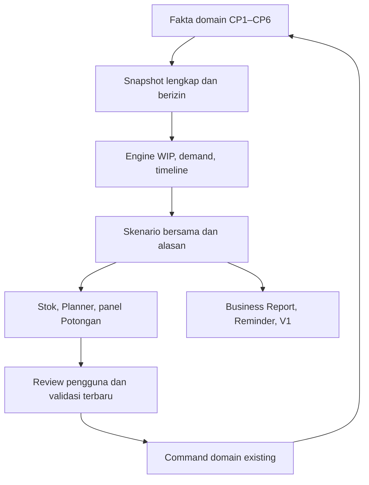

# Framework lengkap CP7 — backbone, integrasi, dan cara kerja

Edisi 28 September 2026 WIB · versi CP7-BACKBONE-20260928-v1.

**Status: persiapan selesai; implementasi CP7 belum dimulai. CP6 tetap HOLD.** Framework ini mengikat kebutuhan bisnis yang ditemukan, kondisi source yang diperiksa, rancangan teknis, urutan penulisan, dan bukti penerimaan. Tujuannya memberi writer berikutnya titik mulai yang konkret tanpa mengulang pembentukan konteks dari nol.

Paket berisi **22 paket kerja**, **271 kelompok kebutuhan sumber yang saling beririsan**, serta **52 kontrak skenario dan vektor uji dengan expected hasil**. Angka tersebut bukan jumlah tes ERP yang sudah lulus.

Dokumen ini merupakan versi baca dari enam bab. Lampiran yang dapat dipakai alat tersedia di `CP7_Backbone_Lengkap_20260928.zip`: registry kebutuhan CSV/JSON, kartu kerja, case contracts, inventaris sumber, keputusan terbuka, JSON Schema, kontrak TypeScript, contoh hasil analisis, validator, dan checksum. Nama berkas relatif di bawah merujuk ke isi ZIP.

Urutan baca:

1. Titik berangkat dan aturan penggunaan.
2. Kontrak bisnis serta interkoneksi checkpoint.
3. Backbone data, algoritme, RPC, state, dan permission.
4. Pembagian kerja Claude/GPT, penulisan paralel, dan tingkat audit.
5. Oracle angka, perjalanan lintas modul, dan definisi selesai.
6. Runbook mulai serta instruksi estafet yang siap diberikan.

Validasi persiapan: **313 pemeriksaan konsistensi berhasil** untuk mapping, dependency, schema, contoh, dan aritmetika sintetis; kontrak TypeScript juga berhasil diperiksa compiler. **Tidak ada hasil runtime CP7 yang diklaim.** Semua 52 case tetap `NOT_RUN` sampai dijalankan terhadap implementasi.

---

## CP7 — Paket persiapan yang dapat langsung diturunkan

Edisi 28 September 2026 WIB · PREPARATION_READY · CP7_IMPLEMENTATION_NOT_STARTED.

Paket ini mengubah kontrak lama menjadi rancangan teknis, paket kerja, expected hasil, dan aturan kolaborasi. Tidak mengubah kontrak bisnis atau mengesahkan CP6. Tidak ada runtime ERP, database, branch produk, atau deployment yang ditulis oleh penyusunan paket ini.

### Titik berangkat

- Repo: `Hanjay6688/-erp-garment-ux`; writer `claude/new-session-deapao` pada `2c2fd5e8e0df5f8ada44402c93f70dbaf0fbbb5b`; tree `20826407e5f98f798b1650f520300e85aebbd2eb`.
- Produk BE yang diuji writer: `73dc4055685e3f6bbefcd4c61bce1e60dcce26e3`. Commit akhir di atas adalah handoff/paket, bukan tes produk baru.
- CP6 HOLD. BE siap audit independen dengan disposisi T2 historis; BD diaudit terpisah. Paket ini tidak mengaku tahu hasil akhir audit itu.
- `main=557005e6674058f1e5e966b350cba05501e06182`; `competition/cp6-j-closure-20260911=ca7f09556397801c50a2277bdb65b1bf019f9a05`.
- `production_go=false`; tidak ada izin memasang CP7 dari dokumen ini. Implementasi baru dimulai setelah CP6 sah dan mandat CP7 diberikan.
- Pengecekan remote membuktikan push yang terlihat pada waktu pemeriksaan; tidak membuktikan editor lokal di chat lain berhenti. Push writer yang tidak dikenal: berhenti menulis dan kabari Hansen.

### Baca secukupnya, lalu kerja dari paket yang ditugaskan

1. `01_KONTRAK_DAN_INTEGRASI.md`: cakupan asli, sumber otoritas, jembatan semua CP, kondisi kode saat ini.
2. `02_BACKBONE_TEKNIS.md`: keputusan arsitektur, data, algoritme, RPC dan batas domain.
3. `03_KOLABORASI_DAN_PAKET_KERJA.md`: urutan paket, kepemilikan, aturan Claude/GPT, anggaran audit dan estafet.
4. `04_BUKTI_DAN_ORACLE.md`: angka contoh yang sudah dihitung, skenario lintas modul, gate dan invalidasi bukti.
5. `05_RUNBOOK_MULAI_CP7.md`: langkah persis setelah gate terbuka, instruksi writer/reviewer, keputusan yang benar-benar masih terbuka.
6. `registries/requirements.json` dan `requirements.csv`: setiap ID asli, sumber, scope, paket, bukti, dan status. Bukan sekumpulan ceklis kosong.
7. `registries/work_packets.json`, `cases.json`, `source_inventory.json`, `decisions.json`: data yang bisa dipakai runner/penerus tanpa menebak dari chat.
8. `contracts/analysis.schema.json`, `analysis.example.json`, `backbone.ts`: kontrak rancangan dan contoh konkret; tidak dipasang di ERP.

### Empat prinsip yang menentukan bentuk CP7

**Satu mesin, enam pemakai.** Stok, Planner, panel Buat/Bagi Potongan, Business Report, Reminder dan Tanya AI memakai hasil analisis yang sama. Formula bisnis tidak hidup sendiri di JSX.

**Sumber fisik sebelum kecanggihan ramalan.** Satu batch yang berpindah jahit–laundry–QC–FG tetap barang yang sama. FG aktual, WIP terarah, kandidat, barang bermasalah dan data unknown mempunyai arti berbeda.

**Sambungan transaksi termasuk scope.** CP7 juga menyambungkan sales/invoice/return/payment, attendance/payroll/Nota, FG handoff, HPP/finance/close/reporting yang masih belum connected. Planner bagus dengan sumber demo belum memenuhi CP7.

**Bukti mengikuti risiko perubahan.** T1 membuktikan keluarga; T2 membuktikan kandidat stabil; T3 membuktikan paket rilis dari baseline yang sesuai. Review independen tetap wajib. Tidak ada ritual rilis penuh pada setiap perubahan kartu; tidak ada tes keselamatan dihapus supaya cepat hijau.

### Langkah pertama ketika benar-benar mulai

Mulai **P00**, bukan langsung membuat halaman. Verifikasi ulang CP6 accepted head/schema/runtime, audit BD/BE dan disposisi lama; pastikan satu writer; isi receipt baseline; buktikan sumber dan jalur yang akan dibaca. Sesudah itu **P01** mengunci kontrak dan **P02** membangun snapshot coherent. Kartu tugas lengkap ada dalam registry. Status baseline saat ini adalah bukti persiapan, bukan accepted base untuk eksekusi nanti.

### Arti “lengkap”

Lengkap terhadap kontrak CP7 rev3, BR V3.1, UX32, WIP/Reminder dan kewajiban integrasi yang ditemukan, dengan seluruh kelompok warisan dipetakan. Bukan janji zero bug, bukan klaim seluruh percakapan telah diambil, dan bukan hasil audit implementasi CP7. Setiap perubahan kontrak setelah tanggal paket ini wajib menghasilkan delta kecil yang jelas; jangan membuat master baru berisi salinan ribuan baris berulang.

---

## Kontrak, batas, dan sambungan CP7

### 1. Otoritas dan cara menangani perubahan

Urutan yang dipakai: instruksi owner paling baru → addendum keputusan yang disahkan beserta errata → Master Pulih M/P dengan revisi scope BR V3.1 dan UX32 → kontrak CP7 rev3 → rancangan teknis dalam paket ini. Source membuktikan apa yang tertulis/terpasang, bukan mengganti keinginan bisnis. Bukti runtime hanya berlaku pada versi dan lingkungan yang dicatat.

| Sumber | Isi yang mengikat | Cara memakai |
|---|---|---|
| M: `ERP_V3_2_Master_Pulih_20260923.md` | Seluruh master, BR V3.1, UX32, WIP, Reminder, arsip audit dan CP7 rev3 | Pakai bagian aktif; status AQ di awal adalah historis, telah dilampaui handoff BE |
| P: `ERP_V3_2_Perubahan_Pulih_20260923.md` | Riwayat perubahan dan keputusan | Rujukan asal; jangan menghidupkan kembali status superseded |
| CP7 rev3, 10 Sep | A–G dan 35 acceptance, adaptive, WIP sebelum SKU, V1 | Semua dipetakan, tidak diperkecil menjadi low-stock alert |
| BR V3.1, di M §BR.0.1 | Mandat BR inti, conditional capabilities, batas optional | Mengoreksi perluasan scope pada addendum BR V3 asli |
| UX32, di M | Ranking tindakan, grouping WIP/pola/material, UI desktop/HP/iPad | Bukan formula baru; 12 cross-check memetakan acceptance lama |
| Addendum CP6 25 Sep dan C6 rev4 | D01–D06, ALL22/ACC39/LAU36 dan CR masuk CP6 | Scope CP6 tidak dilempar ke CP7. Nilai policy pending tidak dijadikan nol |
| Handoff Claude/GPT §15.4, §18, §19; paket A+B 23 Sep | Counterexample, fixture sesuai klaim, bukti proporsional, rilis gabungan | Draft A+B bukan otoritas untuk mengembalikan formula AX lama atau status lama |
| Handoff BE 27–28 Sep | Titik produk terbaru dan disposisi T2 | Writer-ready; independent acceptance tetap terbuka |

Identitas byte sumber ada di `source_inventory.json`. Register mencatat asal baris/section sehingga penerus membuka potongan relevan, bukan membaca ulang seluruh master tiap sesi.

### 2. Cakupan selesai CP7

| Kelompok | Deliverable yang wajib berfungsi | Batas |
|---|---|---|
| A | Snapshot as-of, identitas/lineage, completeness, status produksi terpisah | Unknown tidak menjadi nol; tidak ada ledger write dari kalkulasi |
| B | WIP terarah/kandidat/bermasalah, matching fisik, ETA, kapasitas bersama | Satu PCS dihitung sekali; tariff SKU laundry bukan output SKU |
| C | Baseline demand, target, dated netting, exact-size gap, prioritas | Draft sale sudah mengurangi FG; forecast residual tidak menghitung sale lagi |
| D | Kandidat model, rolling evaluation, parameter/model history | Adaptive betul-betul bekerja pada fixture layak; live tipis tetap fallback |
| E | Planner, panel Buat/Bagi Potongan, grouping, skenario/draf, apply bridge | Read/draf bukan reservation; apply memakai command sah dengan revalidasi |
| F | Tanya AI V1, snapshot sesuai izin, copy/open/manual fallback | Tanpa API berbayar, URL berisi data, kirim otomatis, atau auto-writeback |
| BR | Satu menu Business Report, narasi deterministik, panel Stok, periode dan arsip | Satu engine; laporan on-demand; keuangan tidak false READY |
| Reminder | Wiring manual dan evaluator kondisi in-app yang memakai hasil CP7 | Lifecycle manual tetap; ACK/snooze tidak mengubah fakta bisnis |
| Integrasi | Sales/invoice/return/refund/payment, attendance/payroll/Nota, FG handoff, HPP/finance/close/reporting | Source dan alur nyata, bukan demo yang diberi label connected |
| G | Full dummy-flow, predecessor protections, Auth/HTTP/browser, race, scale, audit exact candidate | Semua consumer final masuk kandidat sebelum audit, bukan ditempel setelah PASS |

Kemampuan bahan tersisa, kapasitas, biaya dan plan-versus-actual **wajib memiliki jalur valid dan jalur unknown yang diuji**. Ketiadaan data live tidak membolehkan placeholder. Tidak ada kewajiban baru membuat optimizer global, jadwal setiap mesin, cash forecast dengan kontrak penagihan baru, scorecard vendor/mandor, modul order/CRM/promosi, atau format ekspor baru. Riset EOQ/newsvendor/MILP adalah bahan opsi; tidak otomatis menjadi gate.

CP7.5 tetap cleanup/rebaseline/fresh-install equivalence. CP7C tetap stress operasional, scheduler/outbox/delivery, backup dan restore tanpa GPT. CP8 tetap audit akhir, rehearsal dan cutover atas mandat owner. On-demand bukan scheduled; accepted provider bukan delivered; CP7 PASS bukan production GO.

### 3. Peta semua checkpoint

Status CP1–CP5 di bawah adalah penerimaan historis pada master, bukan audit ulang saat menyusun paket. Perubahan CP7 yang menyentuh kontraknya wajib menguji kembali keluarga terdampak.

| CP | Fondasi yang diwarisi | Dipakai CP7 oleh | Bukti perlindungan |
|---|---|---|---|
| CP1 | Fingerprint repo/target, satu writer | P00 dan semua penerus | Source/branch/runtime receipt; stop pada writer tak dikenal |
| CP2 | Backup terenkripsi dan restore | P19/rilis | Restore proof baru ketika baseline/paket berubah; evidence lama dipertahankan |
| CP3 | Attendance cost pada APPROVED; PAID settlement; denominator SELESAI_DIJAHIT | P10 payroll, P11 HPP, P02 facts | Approve/paid/reversal sekali; QC/rework GOOD tidak membesarkan denominator |
| CP4 | HPP dan Auth owner | Semua RPC/consumer | Actor aktif, scope nyata, biaya per source dan per tanggal |
| CP4.5 | RBAC, production identity, Master Pola snapshot | P02/P03/P04/P08 | Brand+identity version+size, pola/revisi immutable; empty filter benar-benar empty |
| CP5 | Cutting/pickup/WIP/BS lineage, entitlement dan recovery | P03/P04/P12 | Partial/source capacity, lost reply, correction, posting atomik |
| CP6 | Laundry/QC/FG, tanggal, close, opening ALL, ACC/LAU, conversion/redye/pocket | Seluruh read model dan financial chain | Gate BD/BE/C6/ALL tetap; recost/claim/pocket tidak digandakan |
| CP7 | Perencanaan + wiring + BR + full flow | Paket ini | 35 CP7 dan coverage turunannya, runtime final sama |
| CP7.5 | Clean baseline dan arsip | Setelah CP7 accepted | Behavior equivalence, hash/schema ownership, install/restore |
| CP7C | Operasi mandiri dan pengiriman | Setelah CP7.5 | Load, retries, catch-up, delivery ambiguity, DR, egress gates |
| CP8 | Audit/cutover final | Setelah seluruh prasyarat | Rehearsal exact state, owner GO, transaksi live kecil yang diotorisasi |

### 4. Apa yang ada di kode sekarang

Inspeksi statis pada head `2c2fd5e`, bukan klaim query hosted. Package memakai React 19.2.8, TypeScript/Vite, Supabase JS 2.112.4; `wrangler.jsonc` melayani aset SPA. Tidak ada alasan pindah ke Next.js atau menambah layanan AI. Rancangan server menggunakan Postgres existing; lihat ADR-01.

| Area | Berkas nyata | Temuan / pekerjaan CP7 |
|---|---|---|
| Runtime | `src/config/runtime.ts` | `PARTIAL_CONNECTED`; FG handoff `BLOCKED_UNTIL_AUTHORITATIVE`. Jangan mengganti enum menjadi fully-connected sebelum route terbukti |
| Entry/menu/FG stock | `src/App.tsx`, fungsi `StockCard`, `src/productCatalog.ts` | Stok saat ini mengambil katalog/ledger contoh; P09 harus membuat reader FG chronological, pagination/search dan source drill-down |
| Sales | `src/SalesPages.tsx`, `src/sales/*` | `allInvoices`/catalog dan state lokal; helper eligibility bukan persistence; P09 perlu write/read facade sebenarnya |
| Finance | `src/FinancePages.tsx`, `src/financeData.ts` | Array cash/payables/receivables/payroll/journals; tombol UI tidak membuktikan ledger. P10/P11 menyambungkannya |
| HPP | `src/HppPage.tsx` | `hppLots` contoh; P11 tampilkan source HPP/recost/confidence native |
| Attendance | `src/attendance/AttendancePage.tsx`, `domain.ts` | Wiring harus ditelusuri terhadap facade native CP3; tidak menyimpulkan lulus dari perhitungan frontend |
| Reminder/close/audit | `src/OperationsAdminPages.tsx`, `src/reminders.ts` | State lokal/fixture disclosure; source manual reminder backend sudah ada, evaluator kondisi belum merupakan bukti scheduled |
| Potong/pickup | `src/ConnectedCuttingPage.tsx`, `ConnectedPickupPage.tsx`, `cuttingPersistence.ts` | Reuse `erp_get_cutting_workspace_v2`, selector pickup sah, envelope recovery; jangan menjumlah halaman UI |
| WIP | `src/ConnectedWipStatusPage.tsx` | `erp_get_wip_control_v1`; counter layar tidak otomatis menjadi additive supply |
| Laundry/QC | `src/useLaundryQcWorkspace.ts`, `ConnectedLaundryPage.tsx`, `ConnectedQcFinalPage.tsx`, `LaundryBdPanel.tsx` | Read/write connected dan BD pricing; read model harus menelusuri outstanding/source lines, bukan header qty saja |
| BS/konversi | `ConnectedBsResolutionPage.tsx`, `ConnectedProductConversionPage.tsx`, `productConversion.ts` | BE redye/rework/conversion menjaga lot source dan recost; kandidat planner tidak boleh menciptakan rute baru |
| Pocket/opening | `ConnectedPocketFabricPage.tsx`, `BePocketHistory.tsx`, `ConnectedInitialImportPage.tsx` | Denominator historical/native dan cost source; issue stok sudah terjadi, alokasi biaya tidak membuat issue kedua |
| Auth/facade | `src/auth/*`, `src/types/database.preconnect.ts`, `src/lib/requestEnvelope.ts`, `src/productionRecovery.ts` | Reuse allowlist dan guard; JWT sah tidak otomatis berarti izin role masih aktif |

Nama RPC di tabel adalah entry yang ditemukan pada source, bukan janji semua reader cukup untuk CP7. P00/P02 wajib membuat katalog resolved: signature, effective definition hash, table/trigger/caller dependencies, ACL dan per-date semantics pada database accepted. History migration yang menyebut fungsi bukan bukti definisi aktifnya.

### 5. Kontrak lintas domain yang tidak boleh rusak

#### Identitas, kuantitas, dan kepemilikan

1. Toko adalah customer. Identitas selalu brand dahulu lalu SKU/version/exact size. Kode SKU yang sama antarbrand tidak bergabung.
2. Tujuan sebelum SKU final memakai calon hasil berbasis pola/revisi/material/rute/size. Tidak membuat ID SKU palsu atau histori jual palsu.
3. Satu physical source+size hanya satu posisi aktif. Parent adalah wadah lineage; jangan menjumlah parent dan child atau kirim+terima+QC sebagai supply terpisah.
4. GOOD, BS, hold, stuck/missing dan rework/rewash tidak saling menggantikan. Goods milik pelanggan/titipan bukan FG milik perusahaan.
5. Quantity, ownership, custody/location, condition, valuation dan settlement adalah dimensi berbeda. Barang pulang belum tentu ready; inspected belum tentu bernilai final.
6. COUNT exact integer; meter/kg/yard mengikuti decimal dan UOM yang sah. Parser tidak clamp/round input invalid menjadi angka valid.

#### Biaya, entitlement, dan empat waktu

7. `physical_at`, economic/effective date, accounting/posting date dan `known_at` tetap berbeda. `generated_at` hanya waktu komputasi. Cutoff bisnis Asia/Jakarta; timestamp disimpan ber-offset.
8. APPROVED attendance mengakui biaya sekali; PAID hanya settlement. Rework/konversi tidak menciptakan denominator jahit atau reimburse baru kecuali pekerjaan/komponen tambahan memang sah.
9. Receipt belum invoice memakai status biaya yang sah; UNKNOWN tidak menjadi FREE. Invoice tiga bulan kemudian mengoreksi sumber biaya/GRNI/AP dan turunan HPP/COGS, tidak membuat stok/kerja lagi.
10. Pocket issue memindahkan stok sekali; alokasi periode mengalihkan expense ke WIP/FG/COGS menurut denominator sumber. Jangan memperlakukan seluruh biaya sebagai HPP tambahan tanpa mengurangi expense terkait.
11. Posted immutable. Correction/reversal/successor tertaut; pemulihan angka tidak menghapus fakta bahwa transaksi pernah dipakai. Rollback post-use mengikuti refusal existing.
12. Close/readiness memakai engine preflight per tanggal, bukan saldo total hari ini. Quantity valid boleh ditampilkan saat biaya pending, tetapi margin/ranking profit dan full financial READY ditahan.

#### Transaksi dan informasi

13. Draft sale sudah memengaruhi availability. Draft→posted bukan penjualan kedua dan bukan pengurangan stok kedua. Cancellation/return/refund masing-masing mengikuti sumber sah.
14. Membuka, menghitung, mengurutkan, memfilter, mengekspor prompt, atau ACK tidak mengubah ledger, reservation, SKU status, invoice, order, atau source allocation operasional.
15. Menyimpan analysis/skenario/draf/attention adalah write terpisah yang diizinkan. Hak menyimpan analisis tidak memberi hak membuat transaksi.
16. Apply memeriksa actor terbaru, produksi Stop/Tunda, source/version/capacity/date dan request payload setelah lock. Hasil stale tidak dipakai diam-diam.
17. Balasan hilang setelah commit tetap UNKNOWN/VERIFYING, bukan langsung FAILED. Reuse request ID+payload; command lain yang bisa berbenturan tertahan sampai outcome terbukti.
18. Query gagal/partial/malformed/null tidak berubah menjadi empty/0/aman. Reader lengkap dibuktikan count+cursor+snapshot, bukan menaikkan LIMIT.
19. Report archive menyimpan apa yang benar-benar diketahui saat terbit. Backdate kemudian tidak mengarang knowledge sejarah yang tidak pernah direkam.
20. Permission berlaku pada route, RPC, aggregates, detail, cache, history, prompt dan deep link. Revocation harus diperiksa sebelum replay/cache delivery, bukan hanya login awal.

### 6. Jembatan integrasi yang harus punya bukti

| Jembatan | Masuk | Keluar / oracle | Pemilik paket |
|---|---|---|---|
| Pembelian/opening → material | Receipt, source price, opening provenance, lokasi | Qty/value dan prefix tanggal sah; no duplicate opening | P00/P02/P09/P13, CP6 diwarisi |
| Material → potong → pickup | Roll+yields, pola revision, batch exact size | Sisa raw/WIP; source cost conserved | P03/P04/P09 |
| Jahit → laundry → QC → FG | Completion, DO, receipt, claims, GOOD/BS | Unique remaining; SKU final dari command sah; ETA bukan FG | P03/P04/P10 |
| FG → sales draft/post | Eligible lot+size+location | Availability once; sales event unique; AR pada tahap sah | P10/P11 |
| Sales → return/refund | Invoice/source allocation | Restore barang sesuai kondisi; AR/refund/cash terpisah | P11/P13 |
| Attendance/Nota → payroll → cash | Approved period, source entitlement, deductions/advance | Expense sekali, payable/settlement exact | P12/P13 |
| Invoice/recost → HPP/GL/report | Effective source delta; transitive conversion | WIP/FG/COGS/GRNI/AP per-date reconcile; no false READY | P13/P15 |
| Source facts → planner → apply | Snapshot+policy+scenario+intent | Tidak posting sampai explicit action; latest state under lock | P02–P08/P10/P14 |
| Planner → Stok/BR/Reminder/V1 | Same run+scope+scenario+versions | Same operand, wording conditions preserved | P14–P17 |
| Correction → published archive | New knowledge/source version | Current stale, linked revision; original unchanged | P02/P13/P15/P19 |

P00 tidak boleh menutup gap CP6 hanya dengan mengganti label menjadi CP7. Jika ada sengketa scope, lampirkan requirement dan keputusan yang bertentangan; lanjutkan bagian yang tidak bergantung sambil mempertahankan gate yang benar.

---

## Backbone teknis CP7

Semua nama baru dalam dokumen ini adalah **PROPOSED CONTRACT v0.1**, belum endpoint/tabel yang tersedia. Nama existing diberi label existing. P01 mengunci nama final melalui katalog accepted CP6; perubahan memakai version/delta, bukan mengedit arti field diam-diam.

### 1. Keputusan arsitektur

**ADR-01 — satu engine authoritative pada backend Postgres existing.** Reader fakta, WIP/netting/matching, model evaluasi, scenario allocation, metrics dan reason codes menjadi fungsi modular pada schema analisis privat. React mengonsumsi hasil typed; tidak menghitung saldo atau menjalankan forecast sendiri. Ini pilihan rancangan teknis untuk mulai CP7, bukan kontrak bisnis owner.

Alasannya: aplikasi sekarang SPA statis di Cloudflare dengan Supabase; tidak ada application server/worker kalkulasi yang sudah terverifikasi. Memakai facade RPC existing menghindari penyebaran secret dan engine kedua. Source SQL dipecah per domain/kernel dan dirakit deterministik; **bukan menambah satu migration besar setiap eksperimen**. Python prototipe lama berguna untuk pembanding matematika, bukan implementasi produksi kedua.

P02/P07 mempunyai gate performa: ukur native pada profil kecil/sedang/besar. Bila model berat tidak memenuhi batas kerja, keluarkan satu computation layer utuh ke runtime server yang di-review dalam ADR baru; transport dan schema hasil tetap. Jangan menjalankan versi SQL dan JS dengan rumus berbeda. Ini jalur keputusan jika ada bukti bottleneck, bukan pekerjaan infrastruktur yang otomatis dibuka sekarang.

**ADR-02 — snapshot fakta immutable sebelum komputasi bertahap.** Jangan menyatukan enam RPC live pada enam waktu berbeda. Capture fakta minimum seluruh scope dengan satu operasi snapshot konsisten, kemudian semua model/pages membaca fakta yang telah dibekukan itu. Data live baru menghasilkan stale, bukan mengubah hasil di tengah operator bekerja.

**ADR-03 — projection tidak menulis bisnis.** Role eksekusi analisis memiliki SELECT ke input yang diperlukan dan write hanya ke schema analisis/perhatian yang disepakati. Tidak punya hak menulis ledger/domain atau EXECUTE mutator bisnis. Facade narrow harus menolak actor null/inactive/unauthorized sebelum cache/replay. Jangan memakai service-role browser atau memberi blanket SECURITY DEFINER sebagai obat permission error.

**ADR-04 — source identity dan dependency register bersama.** Setiap source fact mengikat ID asal, line, size, effective identity, source revision dan waktu. Satu registry resolved memetakan input→fungsi→consumer→test, sehingga dampak satu perubahan dapat diketahui tanpa membaca semua file.



Diagram membedakan arus baca dari apply. Membuka consumer tidak mengikuti panah apply secara otomatis.

### 2. Model data minimum

| Entitas rancangan | Kunci / isi | Aturan |
|---|---|---|
| `analysis_run` | run_id, request_id/hash, actor/access epoch, scope, cutoff, capture/hash/version, status | Same request+payload replay; request sama payload beda reject. Refresh disengaja request baru |
| `analysis_fact` | run_id + fact_kind + canonical_source_key; JSON typed/kolom terindeks per jenis | Immutable; unique key mencegah fact yang sama masuk dua kali; jumlah belum lengkap tidak publish |
| `analysis_dependency` | run_id, domain, version/hash, contract version, completeness | Daftar sumber penentu stale; jangan menebak hanya `max(updated_at)` |
| `production_policy_version` | brand/product-identity-version, state ACTIVE/PAUSED/STOPPED, reason, review_at, actor | Terpisah dari master `is_active` dan izin jual; histori append-only |
| `planning_policy_version` | scope inheritance, demand/buffer/model/ranking/calendar parameters | Satu effective version; priority explicit; fixture values tidak menjadi production default |
| `analysis_scenario` / `scenario_allocation` | scenario_id/version, run_id, source+size, target, qty, ETA assumptions | Alokasi simulasi, tidak reservation; constraint kapasitas di dalam satu skenario |
| `analysis_action` | stable action key, intent, source group, demand children, reason IDs | Grouping tidak membuat sumber baru; satu intent/source punya satu kartu utama |
| `planning_draft` / `plan_action_intent` | draft version, input refs, overrides/reason, request/outcome | Read tidak membuat draft. Intent menghubungkan apply dan outcome; bukan ledger stok baru |
| `business_report` / `report_revision` | immutable published body/data, run/scenario/policy/template, period, prior_report_id | Original utuh; current pointer tunggal; revisi baru eksplisit |
| `condition_observation` / existing reminder link | condition key, source key, policy, episode, observed quality, attention | Manual lifecycle existing tetap. Source-resolved berbeda dari ACK/snooze/DONE |

Implementasi boleh menggabungkan tabel analisis yang benar-benar setara; makna kontrak tidak boleh hilang. Cek kemampuan existing sebelum membuat tabel baru. `plan_action_intent` menyimpan hasil apply, **tidak** mengurangi availability saat draf dibuat.

#### Bentuk nilai

- Quantity COUNT: integer nonnegative dalam unit dasar; nilai projection balance boleh signed dan harus bertanda SIMULATION.
- Quantity decimal dan uang: decimal string dengan precision/scale sesuai kontrak domain; uang exact NUMERIC, tidak float JavaScript. Rate dan nominal punya scale berbeda. Round hanya di boundary sah; residual sen ditugaskan deterministik dengan source trace.
- `Value<T> = KNOWN(value, source_refs) | ASSUMED(value, assumptions, source_refs) | UNKNOWN(reason) | CONFLICT(reason, refs) | NOT_APPLICABLE(reason)`. API malformed/partial adalah error/kualitas, bukan varian KNOWN(0).
- Currency, UOM, ownership dan size adalah field eksplisit; compiler/schema tidak menganggap semua `number` boleh dijumlah.
- Status kualitas per domain: quantity, demand, identity, timing, material, capacity, financial. Tidak ada satu `confidence=90%` yang mencampur semuanya.

#### Identitas target

`PRODUCT`: brand_id + product_id + product_version_id + exact_size_id. `CANDIDATE`: model/pattern_revision + material constraints + exact_size + process/finish constraints + allowed brand, tanpa product_id palsu. Kandidat tidak memiliki histori jual sendiri sebelum relasi pembanding sah dipilih dan dilabeli.

#### Identitas source

Gunakan stable lineage key dari sumber existing: cutting group/yield line → batch child+size → completion/allocation → delivery/receipt line → QC lot → FG lot, dengan reference reversal/return/conversion. `source_key` bukan sekadar nomor PO atau label SKU. Dua dokumen menunjuk sumber fisik sama harus dinormalisasi ke remaining slice yang sama. Tidak perlu serial per PCS.

### 3. Capture snapshot dan waktu

1. Validasi actor dan scope berdasarkan akses terkini. Scope analisis/alokasi berbeda dari filter tampilan.
2. Tetapkan `effective_as_of`, `known_as_of`, timezone bisnis Asia/Jakarta, `period_start/end`, dan semantic versions. `known_as_of` lebih lama hanya diterima jika histori/audit memang dapat merekonstruksi fakta saat itu.
3. Capture semua fakta yang saling bergantung dalam **satu snapshot MVCC**. Rancangan awal: satu statement `INSERT … SELECT` dengan reader STABLE yang mengambil semua domain terkait; bukan loop volatile yang membaca live setelah tiap commit. Writer harus membuktikan snapshot concurrency, bukan mengandalkan nama STABLE.
4. Persist fakta analisis dan manifest atomik: row counts, boundary/cursor completion, canonical source keys, dependency vector, semantic hash. Capture gagal berarti tidak ada run COMPLETE.
5. Komputasi bertahap membaca facts immutable. Pagination UI memakai run_id+cursor stable. Query live yang belum selesai diberi CAPTURING/PARTIAL dan tidak masuk netting sebagai nol.
6. Saat publish/serve: cek izin saat ini; tanda stale jika dependencies berubah. Arsip as-of boleh tetap dibaca bila izin masih sah dan label historis jelas. “Terbaru” hanya untuk run yang memenuhi kontrak current.
7. Saat apply: selalu revalidate sumber live di transaksi mutasi. TTL cache bukan bukti sumber belum berubah.

`source_revision` harus berasal dari row version/event sequence yang dapat membedakan insert/backdate/reversal/recost/policy/status/calendar changes. Delete tidak hilang dari vector. Waktu dinding, jumlah baris, atau max timestamp saja tidak cukup.

Untuk sumber sebelum pencatatan knowledge history tersedia: `AS_KNOWN_UNAVAILABLE`. Jangan merekonstruksi masa lalu memakai koreksi masa kini lalu melabelinya “diketahui saat itu”. Current restatement boleh memakai effective cutoff dengan label RESTATED.

#### Snapshot lintas role

Alokasi global mempertahankan keterbatasan sumber walau pengguna memfilter merek. Engine server dapat memeriksa constraint sumber di boundary privat; response hanya memuat fakta dan derived values yang diizinkan. Jika menampilkan remaining capacity akan membocorkan angka scope lain, tampilkan status umum `SCOPE_RESTRICTED`/perlu review berwenang dan tahan aksi yang tidak dapat dibuktikan. Jangan mengembalikan angka tersembunyi lewat total, jumlah kandidat, ranking, cache hit, prompt atau error. Filter bukan reset kapasitas.

### 4. Pipeline algoritme yang menjadi satu otak

#### A. Normalisasi dan quality gates

Validate shape/UOM/identity/version → deduplicate by source lineage → resolve latest state at cutoff → classify ownership/condition → reconcile input/output/reversal → mark per-domain availability. Hindari `Number(x)||0`, koleksi missing→`[]`, fuzzy ID, dan menebak record inactive tidak penting.

Jika quantity critical UNKNOWN/CONFLICT, hasil keputusan aktual `DATA_BELUM_CUKUP`; simulasi berasumsi boleh terpisah. Bila hanya biaya unknown, quantity/timeline tetap boleh dihitung dengan financial status terbatas.

#### B. WIP unique remaining

Untuk tiap lineage slice+size: opening/input sah + linked returns/reversal yang relevan − downstream transfer/terminal output yang berlaku. Posisi aktif dibuktikan dari state transition/cumulative quantities, bukan `sum(all stage counters)`.

Pisahkan: cut-unassigned, sewing-active, laundry-outstanding, laundry-returned-await-QC, FG actual, terminal BS, missing/stuck/hold, rework/rewash. Dispatch/receipt adalah event transisi; incoming yang memakai source sama dikeluarkan dari penjumlahan tambahan. Rework GOOD mengembalikan/mentransformasikan sumber yang sama, tidak mencetak produksi/denominator baru.

Projection GOOD tidak melebihi sisa input setelah constraint/yield. Jika yield asumsi 90%, tunjukkan input, projected output, dan expected loss terpisah. Qty loss projection belum menjadi BS aktual. Setiap shortage tetap exact size.

#### C. Matching calon hasil

1. Hard incompatibility → TIDAK_COCOK: size/range, incompatible pattern revision, material origin, actual wash/process, color/finish, brand/label yang telah mengikat.
2. Confirmed destination + lineage compatible → SESUAI_TUJUAN.
3. Known constraints compatible, tujuan belum confirmed → KANDIDAT_COCOK.
4. Critical matching metadata missing/weak historical hint → PERLU_CEK.
5. Source read incomplete/conflicting → BELUM_DAPAT_DIPASTIKAN.

Nama mirip, pola sama, atau SKU pada paket tarif laundry tidak cukup. Histori boleh memberi contoh dan sample count, bukan calibrated probability. Metadata SKU opsional kosong tidak otomatis reject semua WIP.

#### D. Demand ledger dan observasi

Kunci lifecycle penjualan menghubungkan draft/post/cancel/return. Pisahkan penjualan teramati, permintaan tersensor saat stockout, hari tersedia tanpa penjualan, unknown availability, one-off/event yang memang tercatat, dan manual target/analog berlabel.

Urutan sumber: histori sendiri sah → analog/kelompok beralasan → target manual/skenario uji yang dipilih. Tidak ada auto12 PCS ke semua SKU baru. Retur bukan penghapusan otomatis minat pembeli. Forecast masa depan memakai demand residual setelah transaksi yang sudah masuk cutoff; order baru tidak dibangun dalam CP7.

Kontrol availability: FG100, draft24, residual demand20 → proyeksi56. Draft→posted tetap56. Salah bila memotong draft24 lagi atau memperlakukan posted sebagai demand kedua.

#### E. Forecast, target dan evaluasi adaptive

Kernels rancangan: mean/naive/moving mean, SES, damped Holt, seasonal naive, SBA, TSB. Holt–Winters/ETS tambahan hanya bila evidence/data dan kebutuhan mendukung; tidak ada klaim semua metode riset sudah wajib terpasang. Registry metode berisi eligibility, training requirement relatif H, season length, fit parameters, predictions, metrics, failure mode dan version.

Fallback: `H=L+R`; `Target=ceil(D*(L+R+B))` pada mode buffer hari. Parameter 28 hari history, L21/R7/B7 dari kontrak hanyalah **usulan awal berlabel**, bukan angka pabrik terukur. Pada mode statistik, target adalah kuantil kebutuhan agregat horizon H sesuai policy layanan yang dipilih, tanpa menambah buffer hari otomatis. Quantile harian tidak boleh dijumlah seolah quantile horizon.

Rolling-origin: seluruh training dan tuning sebelum validation cutoff; outer holdout tidak disentuh untuk memilih parameter. Backdated entry baru tidak muncul pada fold lama. Tentukan metric pada jumlah/periode yang sama: MAE, signed horizon bias, absolute horizon-total error; MASE/RMSSE N/A bila denominator nol; MAPE tidak menjadi default saat aktual nol.

Proposal teknis awal untuk promosi model: minimal tiga fold evaluasi yang benar-benar memiliki horizon lengkap, primary metric lebih baik dan guard bias/tail error tidak lebih buruk, tie memilih model lebih sederhana. Ini default rancangan yang harus dikualifikasi P07; bukan kebijakan layanan owner. Bila bukti tidak cukup, pertahankan baseline. Tidak menggunakan skor sintetis sebagai janji hemat modal/akurasi pabrik. Setiap pemilihan menyimpan contender scores, folds, alasan ditolak, model/policy versions.

Data 28 hari tidak otomatis cukup untuk train28 + validate28 + holdout28. Zero yang sah memperbarui TSB; stockout/unknown tidak diperlakukan sebagai zero observation. Target layanan, akurasi historis, confidence statistik dan kelayakan WIP selalu terpisah.

#### F. Timeline, netting dan skenario

`Q_base=max(0,Target−FG_available−directed_WIP_on_time−unique_incoming_on_time)`.

`Q_conditional=max(0,Q_base−candidate_allocated_eligible_on_time)`.

Keduanya ringkasan horizon, harus disertai `balance_end(t)=balance_start(t)+unique_supply(t)−residual_demand(t)`. Tetapkan urutan intrahari jika ada timestamp; jika hanya tanggal, gunakan asumsi timing eksplisit dan jangan mengklaim kebutuhan pagi terpenuhi barang sore. Supply hari20 tidak menghapus gap hari10. Negative simulated balance memakai mode BACKLOG yang dilabeli; LOST_SALES memakai unmet demand terpisah dan tidak mencarry minus sebagai backlog tanpa kontrak.

Safety target tidak dianggap konsumsi harian dan tidak dikurangi dua kali. Produksi baru hanya menutup kebutuhan setelah lead time aktual/asumsi. Early gap yang tidak dapat dipenuhi diberi tindakan expedite/cek sumber, bukan selesai palsu.

#### G. Allocation, material, capacity dan prioritas

Untuk setiap `source+size`: jumlah alokasi seluruh target pada **skenario yang sama** ≤ kapasitas physical eligible; setelah yield, input/output tetap dilacak. Dua skenario alternatif tidak dijumlah. Alokasi sama tetap berlaku lintas halaman/filter. Draf berbeda tidak mereservasi sumber tetapi konflik antar-draf ditampilkan; saat apply latest state menentukan pemenang.

Allocation awal memakai urutan prioritas yang dijelaskan, deterministic tie-break, dan fill sesuai constraint; bukan klaim optimasi global. Ranking: risiko gap sebelum supply siap → deadline nyata → aksi yang lebih cepat membantu → size gap → stable ID. Unknown timing masuk daftar data perlu dicek, tidak otomatis urutan terakhir/aman. Margin hanya boleh ikut bila policy memilih dan cost valid.

Material kebutuhan tersisa = kebutuhan sah − konsumsi/pemasangan terbukti; tambahan eksternal = kebutuhan tersisa − sisa eligible yang terbukti tersedia dan dialokasikan ke pekerjaan itu − incoming unik tepat waktu. Issue bukan consumption. Kebutuhan100, pemasangan60, sisa20 terverifikasi → belum terpasang40, tambahan20. Issue80 saja → tambahan unknown. Stok customer/karantina/rusak tidak dimasukkan ready secara otomatis.

Kapasitas tahap memakai calendar+available capacity−existing load; tanpa waktu per unit/capacity valid tampilkan skenario/UNKNOWN, jangan menciptakan throughput pabrik. Gap100 dengan kemampuan60 tetap gap100, feasible60, unresolved40. Tidak menamai shortage60. Calendar/material change menandai run stale.

#### H. Grouping dan presentation contract

Action key mengikat intent+canonical source/group+scenario. WIP satu batch membantu A/B → satu kartu dan child demand. Dua batch pola sama boleh heading bersama, kapasitas tetap terpisah. Fisik telat dan invoice pending pada batch sama adalah dua intent tertaut, tidak saling resolve.

Usulan cutting dikelompokkan oleh compatible pattern revision/material/rute/need window, dengan exact brand/SKU/size children. Grouping visual tidak menggabungkan PO, roll, invoice atau histori otomatis. Qty net, rounded qty dan rounding extra selalu tampil.

Output action mengandung primary reason, supporting reasons, uncertainty, source links, next authorized command, display priority. Tidak ada score engine di JSX. Same run/scope/scenario/version → same business numbers and reasons di semua consumer.

### 5. RPC dan state machine

| Kontrak rancangan | Input penting | Output / status | Write yang diizinkan |
|---|---|---|---|
| `erp_cp7_start_analysis_v1` | request_id, scope, cutoffs, policy ref, scenario mode | run_id, capture receipt, status | Analysis facts/header saja |
| `erp_cp7_continue_analysis_v1` | run_id, request_id, expected work cursor/version | chunk progress, next cursor, complete/failed | Derived analysis; bounded work, owner claim, no ledger |
| `erp_cp7_get_analysis_v1` | run_id, scenario, filter/cursor, expected versions | authorized typed result + completeness/stale | None |
| `erp_cp7_save_scenario_v1` | run/scenario version, source allocations, overrides+reasons | feasible/conflicts, new scenario version | Scenario saja |
| `erp_cp7_set_production_status_v1` | identity IDs, expected versions, ACTIVE/PAUSED/STOPPED, reason/review date, request_id | updated histories or atomic refusal | Production policy saja, explicit user action |
| `erp_cp7_save_plan_draft_v1` | run/scenario, chosen actions, expected draft version, request_id | draft + dependencies + stale state | Planning draft saja |
| `erp_cp7_preview_plan_action_v1` | draft/action IDs | live preflight, exact domain mapping | None; jika lock diperlukan deklarasikan volatility dengan benar |
| `erp_cp7_apply_plan_action_v1` | draft/action version, request_id/hash, explicit review | existing domain command result and linked intent | Satu command domain yang sah dalam transaksi atomik |
| `erp_cp7_publish_report_v1` | complete run/scenario, period, template, request_id, prior revision | immutable report, revision/current pointer | Analysis/report saja |
| `erp_cp7_observe_conditions_v1` | complete run/domain subset, policy | conditions + linked existing reminder episodes | Observation/attention saja |

Schema types, runtime parser dan RPC allowlist berasal dari kontrak yang sama. Nama yang tidak ada belum boleh dipanggil UI. Public facade mengikuti model Auth existing. Internal helpers default revoke EXECUTE dari PUBLIC/anon/authenticated; exposed objects punya grants+RLS yang sesuai. Views yang digunakan harus mempertahankan RLS melalui security_invoker atau ditutup dari API. Definer yang benar-benar perlu diberi actor guard, fixed search_path, object allowlist, role privileges minimum, dan negative API tests.

Run: REQUESTED → CAPTURING → CAPTURED → COMPUTING → COMPLETE; error → FAILED/PARTIAL, tidak pernah COMPLETE hanya karena command exit0. Snapshot frozen tidak membutuhkan lock WIP/stock selama compute. Continue mengklaim work chunk secara atomik; lease+fencing bila pekerjaan lintas request; retry tidak menggandakan results. Tidak ada scheduler otomatis pada CP7. Run tersisa setelah tab ditutup berstatus belum selesai dan dapat dilanjutkan secara eksplisit; otomatis hidup mandiri adalah CP7C.

Draft: DRAFT → REVIEW_REQUIRED/STALE → VALIDATED_FOR_PREVIEW → APPLYING → APPLIED; ambiguous transport → VERIFYING. Preview tidak menjamin state masih valid saat apply. Data berubah mengembalikan review requirement. PARTIALLY_APPLIED hanya di tingkat kumpulan beberapa command yang sengaja berbeda; setiap command domain sendiri atomik. UI menampilkan item sukses/pending dengan request IDs; jangan berpura-pura keseluruhan batch atomik jika backend tidak menjamin.

### 6. Apply tanpa double production

1. Jalankan global recovery fence existing; outcome ambigu pada source yang berpotensi sama harus diselesaikan dulu.
2. Server autentikasi dan authorize terbaru sebelum replay. Compare request payload hash; lookup outcome untuk request yang sama.
3. Lock dalam urutan canonical domain existing. Tambahan scope `target identity+size / plan intent` hanya bila diperlukan untuk menahan dua rencana membuat produksi yang sama; jangan mengambil lock pocket/finance untuk read yang tak terkait.
4. Re-read production status, source remaining, shared capacity, confirmed production dan dependency revisions. Bandingkan dengan draft; stale → refusal dengan alasan dan tanpa effects.
5. Untuk sumber existing: domain consumption mencegah double penggunaan fisik. Untuk **dua draft dari run berbeda yang sama-sama mengusulkan potong baru**, gunakan target/dependency conflict check dan linked action-intent uniqueness, bukan hanya request_id. Re-evaluate coverage setelah pemenang menciptakan confirmed production; loser review ulang.
6. Invoke existing command; record APPLIED intent dan refs di transaksi yang sama. Tidak dua langkah commit terpisah yang meninggalkan command tanpa receipt.
7. Balasan sukses lalu refetch gagal: tampilkan “Tersimpan, data perlu diperbarui”; jangan membuka submit ulang. Same request replay mengembalikan command yang sama. Override tambahan oleh owner harus eksplisit setelah melihat rencana baru; bukan bypass hidden.

P08 tidak boleh mengaku ini ada sebelum native two-connection proof. Kalau existing command tidak menyediakan precondition yang diperlukan, bridge additive termasuk paket itu; jangan mengirim qty dari URL atau memanggil private mutator browser.

### 7. Business Report dan metric dictionary

Setiap metric: id/version, unit, scope, effective period, knowledge mode, operands+source refs, formula, numerator/denominator bila ratio, quality, financial-readiness, rounding, comparability. Narasi template menerima structured finding, bukan string SQL/HTML bebas.

| Metric | Definisi operasional | Guard |
|---|---|---|
| Actual FG | Saldo authoritative eligible per brand/size/location setelah draft effect | Tidak ditambah WIP; actual-low bisa bersamaan projected-covered |
| Directed/candidate supply | Unique source qty dan ETA; candidate allocated hanya dalam scenario | Candidate total per SKU tidak dijumlah lintas alternatif |
| Stock cover | Eligible FG / valid demand rate dengan horizon/source jelas | Demand nol/unknown → N/A yang tepat; tidak infinity dijadikan aman |
| Sales/revenue | Facts penjualan sesuai accounting contract; draft sales signal terpisah | Tidak menyamakan penerimaan kas dengan omzet |
| Cash actual | Ledger kas/bank bertanggal; internal transfer netral pada total scope | Unpaid invoice bukan kas; reversal/refund ikut sumber |
| AR/AP outstanding | Nominal eligible − linked settled/credit sesuai lifecycle | Bukan seluruh invoice + seluruh payment diperlakukan arus baru |
| HPP/margin | Valid source cost/COGS pada periode; pending recost eksplisit | Tidak memakai unknown=0 untuk profit/ranking |
| Growth/margin change | (current−baseline)/baseline; margin delta dalam poin persentase | Baseline0 → N/A; margin27%→24% = −3pp; aggregate dari operands |
| Aging | Cohort penerimaan/ownership sah dan cutoff | Last movement bukan umur semua stok |
| Plan vs actual | Frozen plan+version dibanding realized sales/GOOD/lead time menurut rule | Tidak menilai rencana masa lalu dengan fakta yang belum diketahui saat itu |

Finding selalu menjawab: apa/siapa, scope/periode, angka dan sumber, syarat/unknown, tindakan berikut, status attention/source. Contoh: “Pada skenario S1 masih ada kebutuhan8 PCS. Angka ini mengasumsikan10 PCS dari batch B1 cocok dan siap pada hari6. Periksa batch/ETA sebelum membuat tambahan.” Jangan menghapus “jika” saat membuat paragraf.

Semantics hash mencakup fakta normalisasi, policy, model, scenario, template dan permission projection. UUID/run ID/generated_at tidak mengubah business semantic hash; **chronology bisnis tidak boleh diurut ulang secara sewenang-wenang**. Simpan hash bytes artifact terpisah. Run opaque di URL tidak berisi payload personal/qty/secret.

Report lama tidak ditimpa; recost baru menandai current stale dan boleh menerbitkan revisi tertaut melalui tindakan sah. Tidak otomatis rebuild/send semua history. Daily/weekly/custom periods membandingkan periode sebanding; intraday bukan dibandingkan hari penuh tanpa label.

### 8. Reminder dan Tanya AI

Reuse manual reminder existing (list/save/done/cancel) dengan server persistence. Evaluator in-app memakai run dan metric yang sama. Condition key = rule version+entity/source+scope+kind; episode berulang tertaut. Observasi unknown tidak menutup incident. ACK/snooze/DONE manual adalah perhatian, bukan bukti shortage/invoice selesai. Hysteresis/comparator/cooldown mengikuti policy yang eksplisit; nilai null, 0, disabled dan invalid berbeda.

CP7 menyiapkan seam scheduler/outbox dan metadata schedule bila existing, tetapi tidak mengaktifkan delivery. RMD-T18–T31 yang menyangkut waktu/transport/destination masuk CP7C; security/no-egress guard tetap diuji di CP7. Read/send/prompt tidak menulis domain ledger.

Tanya AI V1 menggunakan satu serialized authorized AnalysisResult. Clipboard success baru diklaim setelah API clipboard berhasil; popup gagal menyediakan tombol terpisah. Prompt berupa selectable text; tidak query-string, tidak auto-send/login, tidak meminta API key. Free-text notes diberi label data; output AI tidak dieksekusi atau ditulis balik. Truncation volume harus jelas dan menjaga source-capacity constraints, bukan memotong caveat.

### 9. Performa dan observability

Profil uji rancangan: S=100 SKU/5.000 source slices/90 hari; M=1.000 SKU/50.000 slices/365 hari; L=5.000 SKU/250.000 slices/730 hari. Ini beban sintetis untuk mengukur, **bukan volume pabrik yang sudah diketahui**. P00 mencari volume nyata; P19 mengganti/menambah profil bila tidak representatif.

Sasaran engineering awal (untuk dibuktikan, bukan SLA owner): cached page p95≤1s pada harness lokal terkendali; foreground RPC work chunk≤2s; cancellation/resume tersedia; tidak ada truncation diam-diam. Jika run besar butuh banyak chunk, tampilkan progress/COMPLETE yang jujur. Uji pengaruh bersamaan terhadap latency writer, query plan/rows, buffers, lock waits, memory dan payload. Jangan membuat load test production.

Index diarahkan ke run+kind+source, scenario+source+size, actor/scope, lifecycle source/reversal, effective/known boundaries. Gunakan EXPLAIN ANALYZE pada fixture disposable dan ukur RLS; jangan menambah index spekulatif ke seluruh ledger. Capture/compute tidak mengambil domain mutation locks. Auth function yang invariant dalam query bisa di-evaluate sekali dengan pola yang diverifikasi; role scope tetap per row bila memang bergantung row.

Telemetry minimum: correlation/request/run IDs, actor pseudonymous ID sesuai izin, source/contract/runtime hashes, row counts/completeness, duration/query budget, stale reasons, model fallback reason, candidate constraints, error stage, replay outcome. Log tidak berisi secret, JWT, full prompt atau payload pribadi. Alert operasional terjadwal di CP7C; status run dapat dibaca di CP7.

---

## Pembagian kerja, Claude/GPT, dan cara berhenti berputar

### 1. Diagnosis dari riwayat CP6

Ini kesimpulan proses dari bukti yang dibaca, bukan tuduhan bahwa satu model selalu salah atau model lain selalu benar.

| Pola yang terbukti dalam sejarah | Dampaknya | Perubahan cara kerja CP7 |
|---|---|---|
| Claude mengkritik biaya paket per patch; owner menerima A+B pada 23 Sep | Install/rollback/pins penuh diulang sebelum kandidat stabil | T1 keluarga dahulu, T2 kandidat stabil, T3 sekali per paket yang relevan |
| Definisi aktif tersebar dan sebagian asal schema tidak di repo | Writer menilai fungsi lama, dependency terlewat | P00 resolved symbol registry + dependency map; tidak rebaseline global sebelum CP7.5 |
| Invariant sama dijaga terpisah pada banyak fungsi | Satu jalur diperbaiki, caller lain tetap bocor | Kontrak bersama + test family seluruh caller/trigger, bukan hanya fungsi yang ditemukan |
| GPT menemukan guard AV bisa dilewati variasi SQL dan fixture close salah periode | Tes memberi keyakinan melebihi cakupan | Oracle independen dan fixture qualification sebelum menilai produk; structural guard mendahului regex |
| AU/AV fixtures mengubah ACL/katalog atau seed ganda | Banyak INCOMPLETE yang terlihat seperti masalah produk | Fixture library typed/explicit; setup fingerprints; idempotent seeding; no source slicing/SQL text monkeypatch baru |
| BE sempat mengunci pocket domain untuk import yang tak punya pocket rows | Patch satu keluarga merusak race keluarga lain | Daftar lock/caller impact wajib; negative control untuk jalur tak terkait |
| Harga zero-delta bisa mengubah certainty walau tidak mengubah uang | Membandingkan balance saja melewatkan bug status | Reconcile jumlah/nilai **dan** confidence/readiness/provenance |
| Dokumen/klaim writer dianggap status final | Auditor harus memulai ulang pertanyaan yang sama | Pisahkan implemented, writer verified, independent accepted, release qualified, production authorized |
| Context/kuota/chat macet memutus pekerjaan | Estafet mengulang pembacaan dan berisiko double push | Satu CURRENT_STATE kecil, packet receipt, stopped/unknown worker state, remote-head precondition |

Pendapat Claude di handoff §12 tentang banyak migration/script adalah pengamatan 23 Sep, bukan hitungan source saat ini. Insightnya dipakai tanpa menerima semua saran lamanya: misalnya memajukan CP7.5 atau menunda temuan bukan otomatis keputusan owner. D06 terbaru tetap menentukan scope CP6.

### 2. Riset cara kerja resmi dan penerapannya

Sumber resmi dibaca 27Sep2026 UTC. Tidak ada sesi Claude yang dihubungi/diaktifkan dalam persiapan ini. Ketersediaan kuota Claude mengikuti akun owner; dokumen tidak mengasumsikan kuota sudah pulih.

- OpenAI, **Best practices**: prompt berisi goal/context/constraints/done; petunjuk repo ringkas; testing/review terarah. Penerapan kita: packet card, contract registry, satu entrypoint resume. [Sumber](https://learn.chatgpt.com/guides/best-practices)
- OpenAI, **Git worktrees**: checkout terpisah memungkinkan perubahan paralel. Penerapan kita: proposal branches/worktrees; ini tidak menyelesaikan konflik semantik atau race database. [Sumber](https://learn.chatgpt.com/docs/environments/git-worktrees)
- Anthropic, **Best practices**: eksplorasi dan rencana sebelum code; kriteria yang bisa diuji, bukti nyata, reviewer terpisah. Penerapan kita: oracle sebelum patch dan bukti before/after, bukan hanya persetujuan verbal antarmodel. [Sumber](https://code.claude.com/docs/en/best-practices)
- Anthropic, **Agent teams**: tugas mandiri cocok paralel; banyak dependency/edit file sama menambah overhead dan token. Penerapan kita: parallel hanya saat kontrak stabil dan paths terpisah; core schema/app routing tetap satu integrator. [Sumber](https://code.claude.com/docs/en/agent-teams)

Sumber itu mendukung metode kerja, bukan bukti Claude unggul matematika atau GPT unggul SQL. Pembagian di bawah adalah **keputusan proyek berdasar riwayat dan akses yang tersedia**, tidak bergantung peringkat merek/model atau API berbayar.

### 3. Formasi yang disarankan

| Peran | Penugasan awal yang konkret | Batas dan pengganti |
|---|---|---|
| Lead/integrator | GPT yang memegang estafet ini: baseline, source ownership, kontrak, merge queue, evidence index | Satu-satunya penulis branch integrasi; bukan pengesah independen pekerjaannya sendiri |
| Core domain writer | GPT pada P02–P08, setelah gate CP7 terbuka | Satu logical owner untuk snapshot/WIP/demand/scenario; jangan dibelah per SQL function lintas writer sebelum invariant stabil |
| Challenger desain | Claude ketika tersedia: sumber WIP, model evaluasi, dates/close, whole-family impact dan simplifying proposals | Input awal: kontrak+fixture+pertanyaan, sebelum membaca jawaban writer. Kuota dipakai pada seam mahal ini |
| Contributor terisolasi | Claude/GPT untuk satu packet consumer/vertical slice yang kontraknya stabil | Proposal branch sendiri; file/function allowance; tidak menyentuh canonical contracts/shared routing langsung |
| Independent verifier | Sesi/context terpisah, idealnya model lain; wajib punya akses native/Auth/HTTP/browser yang diperlukan | Reviewer yang ikut menulis packet tidak mengesahkan packet itu sebagai independen. Keterbatasan alat → INCOMPLETE, bukan PASS |
| Owner | Kebijakan bisnis yang betul-betul baru, prioritas, accepted checkpoint dan production GO | Tidak dibebani menjadi pengulang test manual atau perantara setiap detail teknis |

Saat Claude belum tersedia: GPT lanjut desain/implementation yang diizinkan, siapkan oracle/challenge packet, dan pakai reviewer independen yang memang tersedia. Jangan membuat persona “Claude” di sesi GPT lalu menyebut cross-model review. Bila tidak ada verifier yang dapat menjalankan gate, status tetap writer-ready; pekerjaan persiapan tidak perlu berhenti.

**Aturan aktif sekarang tetap satu writer.** Parallel code di bawah merupakan desain mode CP7 setelah mandat/assignment yang jelas; tidak mengaktifkan penulis lain pada branch CP6 sekarang. Read-only review dan penulisan oracle terpisah tidak memberi hak push produk.

### 4. Apa yang aman ditulis bersamaan

| Pasangan kerja | Kapan aman | Tidak boleh bersamaan |
|---|---|---|
| Core snapshot/WIP + reviewer oracle | P01 locked; reviewer tidak mengubah product source | Writer mengubah oracle supaya cocok dengan implementation |
| Sales vertical slice + attendance/payroll vertical slice | Reader/facade/DTO fixed; paths dan functions terpisah | `FinancePages.tsx`, shared ledger mutator, permission catalog atau migration manifest dikerjakan dua pihak |
| Planner/panel + BR template renderer | Result schema/reason catalog fixed; private components masing-masing | Menambah rumus netting/score/stock di masing-masing consumer |
| Native verifier + browser verifier | Same immutable candidate; disposable DB terpisah atau fixture partitions terbukti | Dua runner memodifikasi fixture/schema/actor yang sama |
| Model kernel + report presentation | Model interfaces and result shape frozen | Mengubah metric definitions/semantics hasil di kedua sisi |
| Dokumentasi evidence + implementasi | Dokumentasi mencatat source hash spesifik, tidak mengubah acceptance | Mengklaim dokumentasi head baru sebagai native PASS head itu tanpa parity |

Awal: maksimal dua contribution lanes + satu verifier. Tambah lane hanya jika tugas mandiri, source boundaries jelas, dan integration queue tidak menumpuk. Ini batas engineering usulan untuk menjaga biaya konteks, bukan batas teknis platform.

**Satu orang selalu memegang:** `src/App.tsx`, runtime config, database generated types, auth/access catalog, source/ownership registries, migration/release manifest, canonical contract schema, CI dispatch/qualification rules. Contributor mengirim delta terstruktur untuk file tersebut; lead menerapkan setelah rekonsiliasi. Dua worktree berbeda tetap dapat merusak invariant sama, jadi isolasi Git saja tidak cukup.

### 5. Protokol writer dan merge

Setiap assignment mempunyai packet_id, base SHA/tree/schema fingerprint, allowed files/functions, forbidden effects, dependencies, expected tests, claim version dan satu owner. Tidak ada assignment umum “bereskan backend” untuk dua penulis.

1. Lead mencatat assignment pada `CURRENT_STATE`/registry dan base immutable. Contributor bekerja pada branch proposal berbeda; tidak checkout branch yang sama di dua worktree.
2. Before edit dan sebelum push, cek remote integration head, own head, dirty diff dan kepemilikan path. Unexpected push pada writer aktif → STOP_WRITER_CONFLICT; simpan diff sendiri tanpa push lanjutan, kabari Hansen. Tidak force push/auto-rebase di atas penulis tak dikenal.
3. Contributor melakukan T1 keluarga dan menyerahkan patch SHA, changed symbols, dependency impact, fixture/hash, expected/actual, failure history, rollback impact dan remaining risk.
4. Lead review contract drift/semantic overlap; integrasikan satu proposal dalam satu waktu. Proposal kedua di-refresh ke integration base baru dan mengulang hanya tests yang dependency-nya berubah.
5. Pin candidate untuk T2; auditor tidak menulis branch writer. Satu writer juga saat perbaikan temuan audit.
6. Integrator tidak menganggap absent push = writer lama sudah mati. Estafet membutuhkan checkpoint terakhir dan status STOPPED atau UNKNOWN; bila UNKNOWN, jangan mengizinkan dua canonical pushers.

Worktree/branch dengan proposal bukan izin menulis hosted. Seluruh test mutatif di disposable environment; credentials/egress sesuai scope. Tidak mengubah branch protection, secrets atau permission demi memudahkan koordinasi.

### 6. Paket kerja dan dependency

Kartu lengkap yang dapat dibaca mesin ada di `registries/work_packets.json`: input, output, invariant, paths, owner lane, dependencies, exit test dan trap. Tabel ini ringkasannya. Nomor paket adalah ID stabil, bukan urutan serial wajib bagi semua lane.

| ID | Keluarga hasil | Dependency utama | Bukti keluar |
|---|---|---|---|
| P00 | Receipt CP6, status audit, resolved source/CP map | CP6 accepted + mandat sebelum eksekusi | Accepted base dan scope jelas; sekarang BLOCKED_CP6_GATE |
| P01 | Contract v1, oracle, permission/metric/reason catalogs | P00 | Schema/examples valid; semua requirement punya owner/gate |
| P02 | Capture snapshot, facts, completeness, version/stale | P01 | Concurrent capture coherent; incomplete fail-closed; no ledger write |
| P03 | Identity+production state+lineage normalization | P02 | Brand/size/version, Stop/Tunda, source conservation |
| P04 | WIP matching, stage ETA, shared physical capacity | P03 | Partial/rework/BS/stuck/rewash/reversal family native |
| P05 | Demand observation/availability/cutoff pipeline | P04 | Sale lifecycle once; censored versus zero; no future facts |
| P06 | Baseline target/timeline/size/material/capacity | P05 | Angka golden cases dan unknown/conditional valid |
| P07 | Adaptive kernels, rolling evaluation/version history | P06 | Baseline fallback, fold isolation, reproducibility |
| P08 | Scenario/draft/apply bridge dan anti-double-start | P07,P10 | Native same/different run race, replay, stale/refetch |
| P09 | Procurement/material/gudang connected | P03 | Receive/transfer/issue/invoice/reversal source benar |
| P10 | FG stock/Nota handoff/adjustment connected | P04 | Exact lot/size chronological, non-PO source, no demo fallback |
| P11 | Sales invoice/return/refund/payment connected | P10 | Draft availability, AR/cash/return lifecycle once |
| P12 | Attendance/payroll/Nota/advance connected | P03 | APPROVED/PAID/denominator/reimbursement exact |
| P13 | Finance/HPP/recost/close/report reader connected | P09,P11,P12 | Per-date preflight, zero-delta certainty, archived report |
| P14 | Planner/panel Buat+Bagi/Stok/master status UI | P08,P11 | UX32, parity, form preservation, real browser |
| P15 | Business Report on-demand/history/templates | P13,P14 | Metric parity, source refs, correction/revision, permissions |
| P16 | Manual Reminder connected + condition evaluator | P15 | Episode/attention/source separation; no scheduler egress |
| P17 | Tanya AI V1 | P14 | Clipboard/popup fail paths, authorized prompt, offline core |
| P18 | Full dummy lifecycle and predecessor integration | P09–P17 | Stock/WIP/HPP/GL/payables/cash reconcile end-to-end |
| P19 | Multiuser scale/resilience/operational boundary | P18 | Complete pagination, latency/load evidence, role revoke/recovery |
| P20 | Independent candidate audit | P19 | Exact candidate, own oracle+execution, no material unresolved scope |
| P21 | Release package and receipt for next CP | P20 | Install from representative base, T2 parity, rollback/refusal/restore |

Core A→B→C→D→E→F→G tetap dipertahankan. Integration lanes P09–P13 boleh bergerak saat kontrak data siap; tidak menunggu semua UI planner selesai untuk menemukan sumber penjualan masih demo. Consumer prototypes boleh dibuat dari fixture v1 namun tidak diberi label connected sebelum adapter asli lolos.

### 7. Tiga tingkat bukti A+B yang dipakai

| Tingkat | Trigger | Yang dijalankan | Yang tidak boleh diklaim |
|---|---|---|---|
| Contract readiness | Sebelum packet menulis | Schema, manually computed oracle, fixture validity, dependency/permissions | Ini belum runtime PASS |
| T1_FAMILY | Perubahan keluarga | Unit/pure math bila relevan, native controls+negative+replay+race, targeted Auth/browser pada facade berubah | Bukan independent acceptance atau package-ready |
| T2_CANDIDATE | Semua packet kandidat stabil | Full CP7 flow dan seluruh predecessor evidence terdampak; review status per kasus; independent audit | Jangan menjumlah 35/40/12 sebagai independent test count |
| T3_RELEASE | Kandidat diterima, paket dibuat | Representative accepted/hosted-equivalent base, install/pins, T2 pada installed output, CodeQL/advisors, restore/refusal, cleanup | Bukan hosted deployment atau production GO |

T1 failure safety penting tetap: sebelum/sesudah, bad role, wrong size/source, stale version, ambiguous commit, rollback atomic dan competing mutation jika jalurnya berubah. Yang dihemat adalah ritual package penuh yang tidak relevan dengan micro-change; bukan semua DB testing sampai akhir.

### 8. Aturan menghindari audit berulang tanpa akhir

- Satu finding ledger per **root cause** dengan impacted entrypoints, bukan satu nomor baru untuk tiap gejala. Tetap bedakan scope/case yang belum dibuktikan.
- Reviewer mengunci scenario dan expected dari kontrak dahulu. Melihat test writer boleh setelah independent probe awal; blind tidak berarti mengabaikan keputusan bisnis yang sah.
- Klasifikasi wajib: PRODUCT_DEFECT / CONTRACT_CONFLICT / FIXTURE_DEFECT / TOOL_BLOCKER / EVIDENCE_GAP. Exit CI hijau tidak mengubah INCOMPLETE menjadi PASS.
- Dua perbaikan pada akar yang sama belum menyelesaikan family → pause patch lokal, lakukan root-cause/impact review. Tiga setup/tool retry gagal → ubah metode/qualify environment. Ini aturan diagnosis, bukan batas yang membolehkan bug tersisa dikirim.
- Sebelum matrix mahal: schema/runtime/fixture smoke, before counterexample untuk regression fix, after targeted family, compile/access/ownership yang relevan. Kalau smoke gagal, hentikan matrix itu dengan status setup failure.
- Setelah satu batch findings, patch satu keluarga utuh dan verifikasi semua impacted callers; bukan puluhan putaran satu gejala→full suite.
- Tes tambahan harus membuktikan risiko atau mandat yang belum tertutup. Tidak menambah ratusan permutations tanpa invariant baru. Pairwise/metamorphic membantu cakupan namun tidak menggantikan race nyata.
- Audit final mencari defect lain di luar daftar writer, dengan charter dan budget area yang jelas. Berhenti ketika coverage yang disepakati lengkap, tidak ada confirmed material defect yang belum ditangani, serta semua hasil yang belum pasti punya disposition sah. Jangan mengklaim bug mustahil ada.

### 9. Kapan evidence gugur

Evidence receipt mengikat semantic dependency hash, test/oracle/fixture hash, actor setup, schema/runtime/migration base, command, result dan artifact. Artifact hash melindungi byte; semantic hash tidak boleh dipakai untuk mengabaikan perubahan permission/clock/lock.

| Delta | Minimal requalification |
|---|---|
| Teks label nonsemantik/CSS | Render/interaction pada viewport relevan; domain proof reuse bila closure tidak berubah |
| Parser/DTO/API field | Contract+negative parse, consumers, real HTTP, Auth redaction |
| Query/filter/pagination/cache | Snapshot completeness, permission aggregates, temporal/stale, large dataset |
| WIP/source identity/matching | Full WIP family+size+conversion/rework/claims; downstream netting/report parity |
| Forecast/policy/ranking | Frozen math vectors+rolling no-leakage+scenario+reason consistency |
| Command/lock/recovery | Full affected writer family, cross-domain races, refetch/timeout and predecessor controls |
| Financial/date/close/recost | Per-date GL/HPP/AR/AP, late invoice, closed period, historical reports and close race |
| Package/baseline/schema/ACL | Install/restore/refusal + affected T2 on installed runtime; independent disposition |

Documentation-only head boleh merujuk test product head asal beserta parity proof. Jangan memindah label PASS ke hash baru tanpa menjelaskan apa yang identik. Mandatory old source guards dipertahankan; successor qualification harus eksplisit, bukan guard dilonggarkan.

### 10. Paket estafet saat kuota hampir habis atau chat macet

Setelah satu packet atau perubahan arah, update satu receipt: head/tree/schema, active packet, contract version, owned paths, request/run IDs yang belum selesai, PASS/FAIL/INCOMPLETE per case, known defects, next exact action, writer status STOPPED/ACTIVE/UNKNOWN. Simpan patch/checkpoint sebelum memulai matrix panjang atau membuka packet baru.

Jangan menunggu konteks hampir penuh baru menulis master ribuan baris. Start berikut membaca CURRENT_STATE → packet → relevant source sections. Histori besar immutable diarsipkan terpisah. Kalau sesi hilang tanpa stopped receipt, successor read-only reconcile remote/worktree/evidence dahulu; writer tak dikenal tetap memicu stop dan pemberitahuan.

Metrik proses yang dicatat: packet lead time, first-family-pass rate, waktu setup versus waktu tes bisnis, rerun tanpa dependency change, defects lolos T1 ke T2, recurrence root cause, queue integrasi, biaya/kuota bila tersedia. Tidak ada target palsu “100% sembuh dalam N sesi”; arah perbaikan diukur dari pekerjaan ulang yang berkurang tanpa menurunkan gate.

---

## Oracle, bukti lintas CP, dan definisi selesai

Semua angka di sini **fixture sintetis**, bukan data/tarif/kebijakan pabrik. Expected dihitung dari kontrak dan aritmetika yang bisa diperiksa. Penyusunan paket hanya memvalidasi dokumen/vektor; semua pengujian ERP CP7 berstatus NOT_RUN. Kode runtime nanti harus membuktikan expected melalui jalur sah.

### 1. Golden vectors yang sudah berisi angka

| ID | Input | Expected yang tidak boleh bergeser |
|---|---|---|
| O01 | FG18; target48; directed12 on time; allocated candidate10 | Q_base18, Q_conditional8; FG tetap18; candidate label bersyarat |
| O02 | Demand4/hari; L7,R3,B2; FG18; directed12 hari3; candidate10 hari6; new8 hari7 | Target48; demand horizon10hari40; buffer akhir8. End balance:14,10,18,14,10,16,20,16,12,8 |
| O03 | O02 tetapi directed12 pindah dari hari3 ke8 | End14,10,6,2,−2,4,8,16,12,8; gap awal hari5=2 masih ada meski akhir8. Mode BACKLOG diberi label |
| O04 | GapA42+B30; satu kandidat60 size compatible | AllocateA42+B18=60; gapB12. FilterA tidak memberi60 baru; alternatif tanpa kandidat72 tidak dijumlah dengan12 |
| O05 | Target100; FG10; directed laundry60 tepat waktu; kandidat40 | Base30; jika kandidat terkonfirmasi minimal 30 tepat waktu maka tambahan0. Tidak menyebut FG menjadi110 |
| O06 | FG100; draft sale24; residual future demand20 | Available76; projected56; draft→posted tetap56; cancel draft mengembalikan sesuai source, bukan posting dua kali |
| O07 | Kebutuhan sizeS10/L20; FG S25/L5 | S surplus15, L gap15, totalSKU30 tidak menghapus kekuranganL |
| O08 | Net need8; explicit fixture batch multiple12 | Suggested12, rounding extra4; exact size distribution harus feasible. Tanpa policy multiple12 tidak dipaksakan |
| O09 | BOM need100; installed60 proven; unused allocated20 eligible | Not installed40; external additional20. Hanya issue80 tanpa linkage → UNKNOWN, bukan20 |
| O10 | Gap100; material/capacity hanya60 | Needed100, feasible60, unresolved40; tidak menulis shortage60 atau schedule pasti |
| O11 | 14 hari tersedia, sales140; 14 hari stockout | Naive calendar rate5; availability-conditioned10 dengan label asumsi keterwakilan. Lost sales140 tidak diklaim sebagai fakta |
| O12 | Valid sales observations 0,10,0; dua hari lain unknown | Observed periods3, total10, conditional mean10/3; unknown tidak menjadi dua zero tambahan. Rate hasil tetap berlabel sesuai sampling |
| O13 | Revenue1000→1200; margin27%→24%; baseline growth0 | Growth20%; margin change−3pp; growth atas baseline0=N/A, bukan0%/infinite |
| O14 | Internal cash transfer1000, customer receipt300, supplier payment200 | Total cash net+100; transfer net0, revenue tidak disimpulkan300 |
| O15 | Parent100; childA60,childB40. A: sewing20,outstanding10,awaitQC10,FG15,BS5; B: WIP40 | Total WIP80, FG15,BS5=100. DO40+receipt30+QC20+FG15 tidak dijumlah sebagai85 supply |
| O16 | Scenario SOURCE40, capacity36; Aneed30,Bneed30; A prioritas lebih tinggi | A30,B6; unresolvedB24; source unused4. Conditional feasible36, bukan total60 tertutup |
| O17 | SKU STOP, target100, FG10, directed20 | Gap70 tetap terlihat; start_new0; WIP20 tetap harus ditinjau. Sibling brand unaffected |
| O18 | BE pocket fixture denominator10 WIP5/FG3/sold2; cost11.25→15 | Existing expected awal5.62/3.38/2.25; corrected7.50/4.50/3.00. Stock issue tidak terulang; expense direklasifikasi. Mengikuti rounding native, bukan formula round bebas |
| O19 | FG unknown; target48; directed12 | Actual recommendation UNKNOWN/DATA_BELUM_CUKUP. Simulasi FG0 boleh separate dan labeled; bukan actual36 |
| O20 | Nilai forecast horizon constant training, actual all0 | MASE denominator0=N/A; MAE0 jika forecast0. Tidak crash, NaN, atau menganggap akurasi pasti |

O02/O03 berasal dari keluarga BR-T04/T05; O04 dari UX32/WIP-T02; O18 diwarisi exact expected BE, bukan hasil test CP7 baru. Fixture machine-readable memisahkan stage facts dari presentation, mode backlog dan asal policy.

### 2. Invariant yang diuji dari dua arah

- **Conservation:** sum physical positions+terminal outcomes sesuai source lineage; tambah movement tahap tanpa sumber baru tidak menambah supply. Pecah sumber menjadi child setara tidak mengubah total quantity/value.
- **Idempotence:** rerun read/calculation dari snapshot sama menghasilkan semantic hash sama; repeat command key/payload sama satu effect; key sama payload beda atomically rejected.
- **Permutation/pagination invariance:** urutan ingestion atau page size tidak mengubah hasil jika chronology/domain order tetap sama. Sorting bisnis dengan prioritas sah tidak boleh dipermutasi dalam canonical hash.
- **Temporal non-leakage:** menambah fakta `known_at` setelah cutoff tidak mengubah run as-known lama. Restated current boleh berubah dengan revision berbeda.
- **Late-supply rule:** memundurkan supply tidak memperbaiki gap sebelum arrival baru; shortage size lain tidak hilang karena surplus size yang tak dapat dikonversi.
- **Monotonicity yang terbatas:** tambah FG eligible pada size sama, policy/sumber/constraint tetap → raw net need tidak bertambah. Jangan memaksakan monotonicity ke ranking/rounding/capacity/model selection yang bisa berubah karena policy.
- **Permission noninterference:** data scope lain tidak muncul dalam payload, totals, prompt, cache atau reasons. Global constraints tetap diperiksa; response terbatas bisa menjadi unavailable-for-scope.
- **Financial separation:** perubahan payment tidak menciptakan work entitlement/HPP lagi; perubahan cost certainty nol rupiah tetap mengubah readiness bila kontrak menyatakan demikian.
- **No business side effects:** read/compute/filter/report/ACK/export before-after compare **seluruh operational tables dan relevant sequences/events**, dengan allowance tepat pada analysis/attention metadata; tidak cuma saldo akhir.

### 3. Alur end-to-end yang wajib benar-benar dijalankan

| ID | Cerita pabrik / titik pemeriksaan | Jembatan CP | Minimal evidence |
|---|---|---|---|
| E01 | Opening sah → receipt material → cutting → pickup → sewing → laundry partial → QC/FG per size → sales draft/post → payment → report | ALL/CP5/CP6→CP7 | Native reconciliation di setiap boundary; satu browser journey real Auth |
| E02 | Dua child dari parent; laundry partial, stuck/missing claim, susulan, BS/rework/rewash, partial QC | CP5/6→WIP | Parent/child/counter conservation, stage timestamps, no duplicate incoming |
| E03 | FG → sales return partial → customer service → accessory use → returned good/BS → refund | Sales/ACC/finance | Ownership, custody, inventory, AR/refund terpisah; no fake company FG/customer entitlement |
| E04 | Ganti merek/rework SKU baru/redye → sold child → supplier/vendor invoice correction | BE/BD→cost/report | Source cost transitive ke FG/COGS; no labor/BOM/qty double; zero delta certainty |
| E05 | Payroll attendance APPROVED → paid partial/full; accessory deduction/advance; reverse | CP3/ACC/finance | Expense once, denominator immutable, remaining entitlement/cash conserved |
| E06 | Fisik akhir Desember, invoice tiga bulan kemudian, recost pending/final, historical report, close | D01/AW/BD/BR | Physical/economic/accounting/known separate; as-known archive unchanged; close race guarded |
| E07 | Historical pocket import + native/Afui result → allocation → sale/return/conversion → invoice delta | ALL-C04/BE→HPP/BR | Exact source roundoff, expense reclass, no phantom sewing/material movement |
| E08 | Stok → Planner → panel Potongan → BR → Reminder → V1 pada run/scope/scenario sama | Seluruh consumer | Operand/reason/status parity; actions unique; no hidden formula |
| E09 | Report lama dibuka setelah source/policy/calendar/permission berubah | Snapshot/Auth | Stale/denied tepat; archived/current distinguished; apply revalidates |
| E10 | Dua browser apply source sama, key sama/different payload dan draft berbeda | Scenario/domain | One authorized source consumption; loser stale/refusal, no orphan |
| E11 | Dua run berbeda sama-sama usulkan produksi baru untuk gap sama | Planner→cutting | Target/dependency conflict and linked intent; no duplicate plan-induced start |
| E12 | Commit sukses balasan hilang; reload; dari tab lain coba Laundry/QC/sales pada source terkait | Recovery/CP5/6 | Request envelope stable, source fence, same replay, no false failure/new UUID |
| E13 | POSTED immutable; reversal/late correction sesudah penggunaan turunannya | Semua ledger | Linked facts, exact inverse atau lawful refusal; no deletes/overwrites |
| E14 | Role null/inactive/revoked; viewer; cross-location/source; authenticated browser and raw HTTP | Auth/CP4.5 | Server rejection, data no leak, state before-after exact; no service-role shortcut |
| E15 | Query source timeout/partial page/malformed/conflict; good qty bad cost | Readers/BR | Domain partial honest, no seeded fallback or false zero/READY |
| E16 | Report publish doubleclick/retry, concurrent current pointer, later revision | BR/storage | Same request replay, unique revision/current, original immutable |
| E17 | Manual reminder edit/DONE/CANCELLED+reload; automated condition ACK/snooze/recover/recur | Reminder | Persistence, episode once, attention≠source resolved, no real delivery |
| E18 | Clipboard denied/pop-up blocked/ChatGPT offline; malicious-looking source note | V1/UI | Manual fallback, successful copy message honest, escaped text, no URL data/AI call |
| E19 | UI desktop/HP/iPad keyboard/touch; dirty cutting form; detail-back/filter/ranking stale | UX32 | Real screen/interaction no lost input, scroll/filter stable, no nested modal trap |
| E20 | Large source spanning multiple pages; one candidate shared across visible/hidden scope | Completeness/perf/Auth | Full aggregates, capacity conserved, redaction, bounded query/run |
| E21 | Upgrade from qualified base → T2 on installed candidate → rollback pre-use → reinstall → post-use refusal → restore | CP2/CP7→CP7.5 | Catalog/data/ACL/history/markers match required level, unchanged primary, cleanup receipt |
| E22 | Read/compute/export/ACK over whole fixture with poisoned mutator privilege controls | Analysis separation | No operational table/counter change; compute principal cannot invoke writers |
| E23 | New/paused/stopped/active status bulk by brand/range; past review date; stale draft | Master/Planner | No auto-reactivate/cancel-existing; authorized action only; atomic multi-row version check |
| E24 | Receipt/warehouse transfer/inactive location/backdated prefix; late price and source return | Procurement/CP6 | Exact qty/value, complete server list, no false average/stock, branch/source correct |

Setiap journey mencatat checkpoints domain, tidak cuma halaman tampil. E01 dapat membuktikan beberapa requirement; dicatat sebagai satu eksekusi dengan mapping, bukan digandakan menjadi puluhan test count.

#### Worksheet E01/E03: satu produksi sampai penjualan dan retur

Fixture qualification lebih dahulu menetapkan satu brand/size, seluruh 60 PCS GOOD, tanpa yield loss, kurs/pajak/diskon, serta sumber biaya sah: raw600, sewing120, aksesori60, laundry120. Total900, HPP15/PCS. Angka adalah konfigurasi disposable yang harus didukung domain existing; setup ditolak jika source/entitlement tidak bisa dibentuk secara sah. Jangan mengisi hasil HPP langsung di tabel atau mengganti expected agar cocok dengan kode.

| Checkpoint | Jumlah dan nilai yang diperiksa |
|---|---|
| Receipt dan cutting | Raw100 unit×10=1000; konsumsi60 unit=600; raw sisa40 unit bernilai400. Konversi yield fixture60 PCS valid dan tercatat |
| Sewing/laundry/QC partial | Dua leg30+30 dan QC20+40; jumlah yang sama berpindah tahap, total output60. Biaya sumber lain300 diakui sesuai tahap/kontrak, tidak diulang saat invoice/payment |
| Semua FG | FG60 bernilai900; WIP fisik produksi itu0; HPP15/PCS; source biaya600+120+60+120=900 |
| Draft sale20 | Availability FG40; tidak dipotong20 lagi ketika menjadi posted. Timing GL sementara mengikuti domain accepted, bukan diasumsikan oleh UI |
| Posted sale20 pada 25/PCS | Net sales sebelum return500; final COGS300; FG40 bernilai600. Financial readiness harus final atau tampil pending yang menahan claim ini |
| Customer payment200 | Cash+200, AR300; omzet tetap500; COGS tetap300; payment tidak mengubah stock/HPP |
| Return5 eligible GOOD pada harga asal, credit applied ke AR | FG45 bernilai675; COGS net225; revenue net375; AR175; cash tetap200. 200+175=375. Return yang sama diulang tidak memberi5 lagi |

Cabang E03 customer-owned service/refund memakai fixture sumber sendiri. Jangan menganggap barang pelanggan menjadi company FG, atau memaksa refund uang jika transaksi hanya menimbulkan pengurangan piutang dan belum memiliki refundable credit yang sah. Setelah final flow, report dan source detail harus menjelaskan375 revenue,225 COGS,150 gross profit dari operand yang sama; bukan menghitung margin dari cash200.

### 4. Model evaluation scenarios

| ID | Skenario | Expected |
|---|---|---|
| M01 | Histori pendek terhadap H; beberapa unknown days | Eligibility menolak model yang tidak punya fold valid; fallback beserta alasan |
| M02 | Mean/SES/Holt/SBA/TSB menerima prefix training sama | Predictions finite/nonnegative dengan parameter/domain bounds; zero updates sesuai availability |
| M03 | Future rows dan backdated-known-later ditambah ke dataset | Predictions/model choice pada cutoff lama identik; input immutable |
| M04 | Challenger lebih baik validasi tetapi kalah outer holdout | Laporan menunjukkan keduanya; holdout tidak dipakai retune agar tampak menang |
| M05 | Baseline tie/lebih baik, seasonal data tidak cukup siklus | Baseline dipertahankan; no invented season or fake calibrated confidence |
| M06 | Buffer hari versus statistical target, quantiles with proper horizon | Satu mode aktif; forecast/service/WIP confidence tidak dicampur |
| M07 | Kalender/lead time/yield berubah, capacities unknown/overload | New version/stale, ETA assumption label, no unsupported feasibility |
| M08 | Plan version dibanding actual setelah partial/reversal/late entry | Comparison attributable to plan version; future knowledge tidak dipakai menilai keputusan awal sebagai pasti salah |

### 5. Fixture qualification dan oracle independence

Fixture valid harus punya actor role aktif, sumber benar, chronology masuk scope, window close benar, version/policy tepat, request ID unik per intent, lineage dan UOM sah. Setup writes dihitung; baseline catalog tidak boleh berubah karena grant fixture yang lupa dicabut. Clone berisi seed tidak diseed ulang tanpa precondition yang benar.

Expected datang dari kontrak/numeric ledger worksheet, bukan memanggil helper produksi lalu membandingkan helper itu dengan dirinya sendiri. Regression fix membutuhkan failure pada predecessor atau mutant yang representatif. Fitur baru yang memang tidak punya route before diberi NO_ROUTE/NOT_APPLICABLE sesuai charter; itu bukan bukti counterexample bisnis predecessor.

Verifier memisahkan setup failure dari product failure. Screenshot/DOM dengan mocked RPC membuktikan interaksi saja; hosted/disposable Auth+HTTP+native source mempunyai evidence berbeda. Review code bukan runtime audit. Native auditor yang tidak bisa menjalankan satu kasus pun harus berkata INCOMPLETE.

### 6. Coverage dan ledger status

Registry menjaga **35 CP7 +40 BR +12 WIP +12 UX32 +36 RMD**, lalu audit33, ACC39, LAU36, CROSS6 dan ALL22 sebagai kewajiban warisan/interkoneksi. Banyak overlap; angka itu kelompok requirement, bukan jumlah test baru. Setelah generator dijalankan, angka aktual hasil parsing ada di validation report. Tidak menjumlahnya menjadi klaim 271 tes lulus.

Status per requirement: NOT_RUN (CP7), UPSTREAM_ACCEPTANCE_PENDING (CP6), FUTURE_CP7C (seam diuji sekarang), OPTIONAL_NOT_SELECTED, atau WRITER_VERIFIED/INDEPENDENT_ACCEPTED setelah bukti nyata. Hasil case: PASS/CONTROL_PASS/COUNTEREXAMPLE/FAIL/INCOMPLETE/BLOCKED/POLICY_BLOCKED/NOT_APPLICABLE dengan alasan. Status CI success dan result per case wajib dibaca bersama.

CP6 yang masih HOLD tetap dilaporkan terpisah. T2 BE memiliki historical dispositions; original results tidak diubah jadi PASS. Saat CP6 diterima, P00 mengimpor keputusan per-ID dengan source acceptance; tidak menghapus 12 HOLD hanya karena nama phase sudah CP7.

### 7. Definition of done per feature

Satu feature selesai bila memiliki input authoritative dan lengkap, source/provenance/quality, behavior business dan permission server, entry UI connected, failure/replay/stale yang jujur, test positive/negative/cross-domain sesuai risikonya, serta source-bound evidence yang dapat dijalankan ulang. Tidak cukup karena code compile atau route ada.

CP7 kandidat siap acceptance bila seluruh mandatory rows CP7 selesai dengan bukti, conditional capabilities mempunyai valid+unknown path, optional/future dipisah tanpa menghapus kewajiban, semua interkoneksi E01–E24 relevan teruji, dan tidak ada confirmed material correctness/security defect atau required INCOMPLETE yang ditutupi.

Independent acceptance membutuhkan auditor terpisah atas exact candidate/runtime; full dummy flow dan financial reconciliation tidak digantikan writer claim. Rilis membutuhkan T3. Production GO tetap owner pada checkpoint/cutover yang benar. Tidak ada jaminan software sempurna; yang diberikan adalah definisi terukur yang mencegah “kelihatan jalan” disebut selesai.

---

## Runbook mulai, estafet, dan keputusan

### 1. Status yang dibawa sekarang

```json
{
  "framework_version": "CP7-BACKBONE-20260928-v1",
  "mode": "PREPARATION_ONLY",
  "repository": "Hanjay6688/-erp-garment-ux",
  "observed_writer_branch": "claude/new-session-deapao",
  "observed_writer_head": "2c2fd5e8e0df5f8ada44402c93f70dbaf0fbbb5b",
  "observed_product_head": "73dc4055685e3f6bbefcd4c61bce1e60dcce26e3",
  "cp6_gate": "HOLD",
  "cp7_implementation": "NOT_STARTED",
  "accepted_execution_base": null,
  "accepted_execution_base_reason": "CP6 independent acceptance pending; observed head is not an accepted CP7 base",
  "active_preparation_packet": "FRAMEWORK",
  "first_execution_packet": "P00",
  "production_go": false,
  "hosted_mutation_authorized_by_this_package": false,
  "external_ai_api_required": false,
  "claude_session_contacted": false
}
```

Null accepted base adalah keadaan yang diketahui, bukan ruang kosong yang boleh diisi dengan HEAD terbaru secara otomatis. Setelah audit selesai, tulis delta receipt terhadap nilai ini; jangan membuat framework baru dari nol.

### 2. Sepuluh langkah pertama setelah CP6 sah dan owner memberi mandat CP7

1. Baca `00_MULAI_DI_SINI`, current handoff repo, accepted audit BD/BE/CP6, contract delta sesudah 28 Sep. Cocokkan remote head/base/tree dengan acceptance; jika berbeda lakukan impact map.
2. Verifikasi single writer; claim P00. Cek worktree/diff dan proses/test aktif yang diketahui. Writer tak dikenal → stop penulisan dan kabari Hansen; jangan force push atau mengasumsikan diam berarti berhenti.
3. Buat branch CP7 yang disepakati dari accepted base; branch CP6/auditor/main tidak dipakai sebagai scratch. Nama rekomendasi `cp7/integration`; ini belum dibuat oleh paket persiapan.
4. Buat disposable database dari qualified baseline, tanpa egress. Rekam PostgreSQL/Supabase/lockfile/build identity. Hosted/legacy tetap mengikuti batas izin yang sudah ada; tidak deploy dari langkah ini.
5. Ambil katalog definitions/signatures/owners/ACL/triggers/callers serta source hashes yang dibutuhkan. Verifikasi latest function definition, bukan file migration pertama yang cocok.
6. Buat source-read smoke untuk FG, sales lifecycle, WIP source+size, policies, material/capacity, HPP/readiness; catat missing adapter secara spesifik. Inventory static dalam paket adalah start point, bukan kelulusan runtime.
7. Kunci P01 contracts/metric/reason/permissions dan oracle. Verifier menulis expected sebelum melihat implementation baru; validasi fixture cutoff, role, predecessor state dan counts.
8. P02 snapshot coherence vertical slice: satu SKU/size dan dua child batch, satu sales draft, satu cost pending. UI diagnostic bukan fitur rilis; buktikan full facts/no ledger effects/native Auth terlebih dulu.
9. P03/P04 source normalization+WIP. Jalankan O15 dan E02, negative/control branches; baru masuk demand/baseline P05/P06. Setelah contract stable, integration lanes P09–P13 dapat diberi assignment terpisah.
10. Update CURRENT_STATE/packet receipt, jalankan gate T1 yang relevan, serahkan untuk challenge terarah. Jangan membuat T3 baru pada setiap kernel/komponen.

Existing commands yang ditemukan: `npm test`, `npm run build`, `npm run test:security`, `npm run build:cp6-disposable`, dan Playwright configs CP5/CP6. Gunakan sesuai delta/required gate; perintah deploy/Cloudflare upload bukan verifikasi lokal. Runner `cp7` belum ada; P01/P02 membangunnya sesuai case registry, jangan mengklaim perintah baru tersedia dari dokumen ini.

### 3. Instruksi siap diberikan kepada writer P02

> Kerjakan packet P02 pada accepted base hasil P00 dengan contract P01. Tujuan: capture snapshot coherent yang dipakai seluruh CP7. Baca02_BACKBONE_TEKNIS §2–3 dan cases E15/E20/E22. Sumber awal existing: src/config/runtime.ts, src/ConnectedWipStatusPage.tsx, useLaundryQcWorkspace.ts, src/types/database.preconnect.ts, dan resolved catalog P00. Miliki hanya scripts/cp7-src/snapshot/, source facts reader dan tests/cp7/families/snapshot yang ditugaskan; shared types/ACL changes kirim sebagai delta untuk integrator. Jangan menulis ledger, mengubah CP6 business rules, memanggil hosted mutator atau menutup 12HOLD. Expected: coherent concurrent snapshot, strict null/partial rejection, run+cursor complete, actor revocation tested, no business-table changes. Tulis test/oracle/fixture hashes, before/after where applicable, product/tool defect distinction dan remaining limitations. Jika remote writer head bergerak tak dikenal, stop dan lapor. Exit packet adalah T1_FAMILY, bukan CP7 PASS.

### 4. Instruksi siap diberikan kepada Claude sebagai challenger

> Review backbone CP7 dan packet P02–P08 secara read-only. Fokus pada source+size conservation, source reuse across stages/plans/filter, four clocks, no future leakage, quantity versus valuation, dan anti-double-start dari dua draft berbeda. Sebelum membaca implementasi writer, tulis expected untuk O02/O03/O04/O15 dan E06/E10/E11 dari kontrak CP7 rev3, BR V3.1, D01/D06 yang sah. Kritik asumsi/arsitektur yang menambah biaya tanpa menaikkan reliability. Setelah oracle terkunci, baca patch pada SHA yang diberi dan jalankan native probes sendiri bila akses tersedia. Jangan menulis branch writer, jangan mengarang runtime PASS jika alat tidak tersedia, dan jangan mengubah policy owner menjadi preferensi model. Serahkan finding root cause+repro+expected/actual+scope, atau hasil kontrol yang menolak dugaan. Bila kuota terbatas, prioritaskan seam source/time/permission sebelum kosmetik UI.

### 5. Instruksi siap diberikan kepada independent auditor P20

> Audit kandidat CP7 exact SHA/tree/schema/runtime yang dicatat P19. Ini bukan penulisan produk. Mulai dari accepted contracts, requirement registry dan fixture charter; buat scenario/oracle independen sebelum membaca expected writer. Verifikasi candidate capabilities dan full-flow, cari counterexample di luar daftar fix writer, khususnya sales draft lifecycle, WIP uniqueness, pre-SKU matching, two-plan apply, close/late invoice, revoked role, incomplete reader, report revision dan no-ledger-effects. Jalankan native+Auth/HTTP+browser yang relevan sendiri; pisahkan reuse evidence yang dependency-nya masih sah. Baca status per case, bukan summary CI. Jangan mutasi hosted/legacy/production, jangan push writer branch. Output verdict ACCEPT/HOLD/INCOMPLETE dengan exact scope, confirmed defects, limitations, dispositions dan next action. Tidak ada writer self-acceptance atau production GO.

### 6. Keputusan yang sudah ada — jangan ditanyakan ulang

| Topik | Keputusan |
|---|---|
| A+B | Bukti proporsional per keluarga, satu kandidat stabil, full release proof pada paket gabungan |
| WIP sebelum SKU | Diperbolehkan sebagai kandidat fisik bersyarat; bukan FG pasti |
| Actual unknown | Tetap unknown; estimasi/asumsi boleh pada rekomendasi dengan label |
| Draft sale | Availability sudah terpengaruh sekali; no reserved/ATP deduction kedua |
| Stop/Tunda | Terpisah dari master active/sales; tidak auto-reactivate atau auto-cancel WIP |
| AI | Tanya AI V1 copy/open/manual; engine dan report tanpa API AI berbayar |
| Business Report | Satu menu, deterministic narration, reason/dasar hitung per SKU di Stok |
| Timeline dan size | Dated gap dan exact size wajib; late source tidak menutup gap awal |
| Scope CP6 | ALL22/ACC39/LAU36 dan CR D06 yang dimandatkan tetap diselesaikan CP6 |
| CP sequence | CP6 → CP7 → CP7.5 → CP7C → CP8; production GO terpisah |

### 7. Hal yang perlu diisi dari sumber, bukan ditebak

| ID | Ketidakpastian | Tindakan sekarang / kapan mengunci |
|---|---|---|
| CP7-OPEN-01 | Accepted CP6 base dan hasil audit BD/BE final belum tersedia di paket | BLOCKED_UPSTREAM; import acceptance receipt di P00, bukan pertanyaan bisnis ulang |
| CP7-OPEN-02 | Nilai bisnis target layanan/buffer/calendar/capacity nyata | Gunakan fallback kontrak yang berlabel dan fixture terpisah; policy ditinjau saat setup operasional. Tidak menghalangi pembangunan jalur unknown/valid |
| CP7-OPEN-03 | Reconstruction known_at lengkap sebelum snapshot system tersedia | Query audit/history nyata di P02; bila tidak cukup, AS_KNOWN_UNAVAILABLE untuk periode itu |
| CP7-OPEN-04 | Scope role yang boleh melihat global planning/material/cost dan siapa mengubah policy | Petakan permission existing, default deny privilege baru; bawa hanya gap bisnis yang tak punya keputusan |
| CP7-OPEN-05 | Performance database engine pada volume nyata | Spike bounded di P02/P07, profile di P19. ADR teknis alternative hanya jika hasil gagal target dan bottleneck jelas |
| CP7-OPEN-06 | Policy pending nilai pada aksesori/laundry | Ikuti CP6 latest accepted config; pending tetap pending, tidak isi nol/free atau tariff ilustrasi |
| CP7-OPEN-07 | Apakah optional cash forecast/scorecard/order/export baru kelak dipilih | OPTIONAL_NOT_SELECTED; tidak dibangun dan tidak blocker CP7 inti |
| CP7-OPEN-08 | Kanal/schedule/delivery dan SLA/RPO/RTO operasional | Milik CP7C/cutover; seam saja sekarang, no unauthorized egress |

Keputusan teknis terdelegasi (folder, schema shape, grouping, query strategy, test organization) diselesaikan writer dari bukti. Jangan membawa semua pertanyaan teknis ke owner. Konflik kebijakan bisnis yang benar-benar baru harus ditulis konkret dengan contoh dampak, bukan ditutupi asumsi diam-diam.

### 8. Bentuk checkpoint yang harus disimpan penerus

Receipt wajib: packet/version; base/current heads; runtime/schema; allowed paths aktual; changed symbols/dependencies; evidence per case; tests not run+reason; findings status; artifact refs/hash; side effects/cleanup; active request/run IDs; writer ACTIVE/STOPPED/UNKNOWN; next exact command/task; independent gate status. Jangan mencatat secret/DSN/token.

Contoh receipt persiapan sudah berisi fakta:

```text
packet=FRAMEWORK; status=PREPARATION_READY
observed_base=2c2fd5e8e0df5f8ada44402c93f70dbaf0fbbb5b
changed_product_paths=[]; hosted_mutations=0; deployments=0
evidence=document/schema/traceability/arithmetic validation only
ERP_CP7_runtime_tests=NOT_RUN
CP6=HOLD; independent_BE=awaiting; BD=separate audit
next=P00 after accepted CP6 and CP7 mandate
```

### 9. Tanda bahaya yang harus langsung mengubah tindakan

Unexpected writer push → stop writing dan kabari. Wrong database/legacy target → hentikan eksekusi mutatif. Unknown commit outcome → verify dengan request yang sama, jangan blind retry baru. Critical data partial → jangan publish READY/apply. Confirmed financial/stock/HPP correctness bug → tahan affected gate dan perbaiki satu keluarga. Tool failure → INCOMPLETE dan perbaiki lingkungan; jangan memodifikasi oracle untuk menghasilkan PASS.

Dokumen ini tidak membuat pengingat atau pemantauan latar belakang. Pemeriksaan branch berlaku saat sesi melakukan pemeriksaan; successor mengulangnya sebelum menulis.

